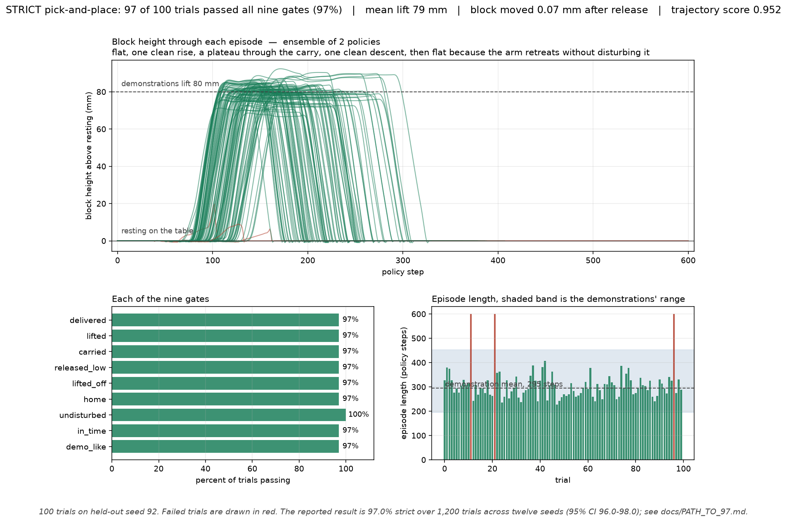
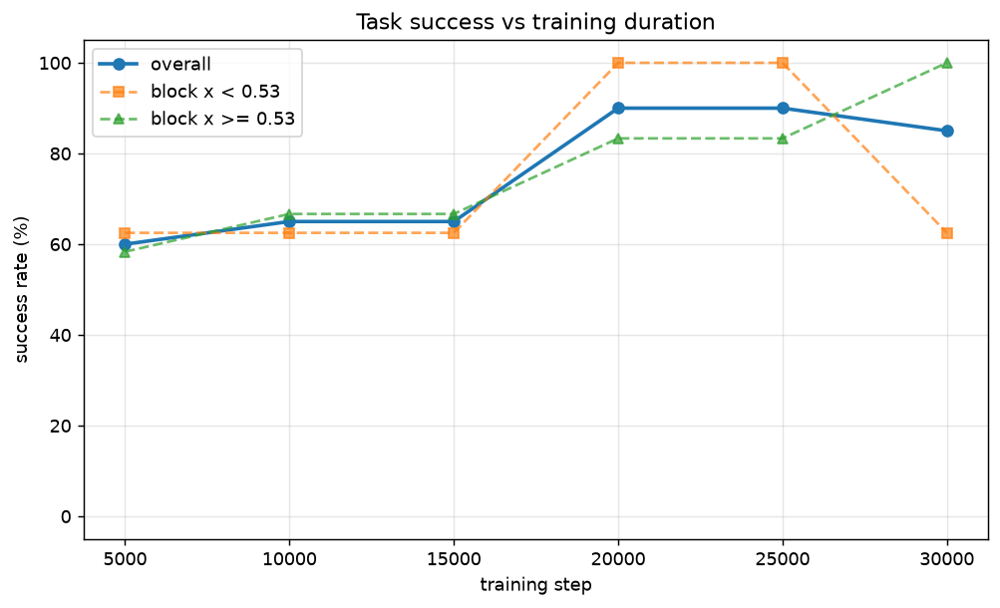
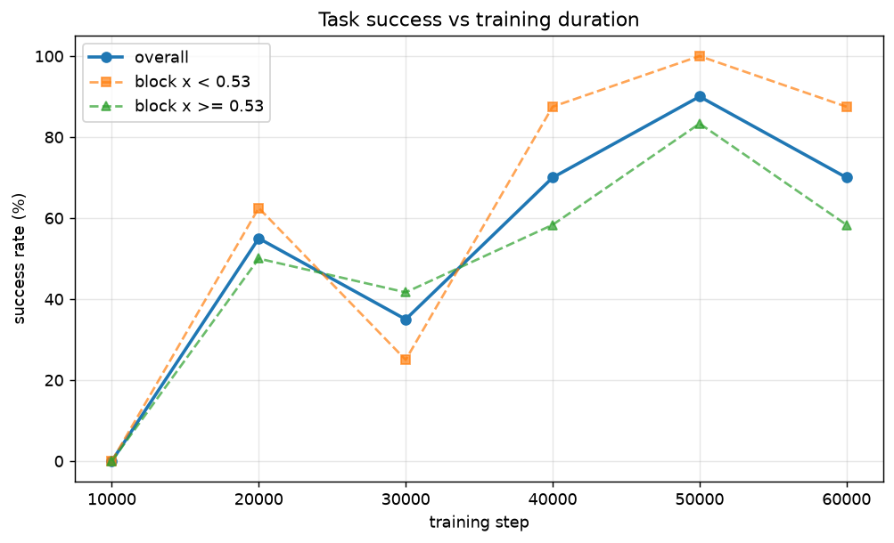
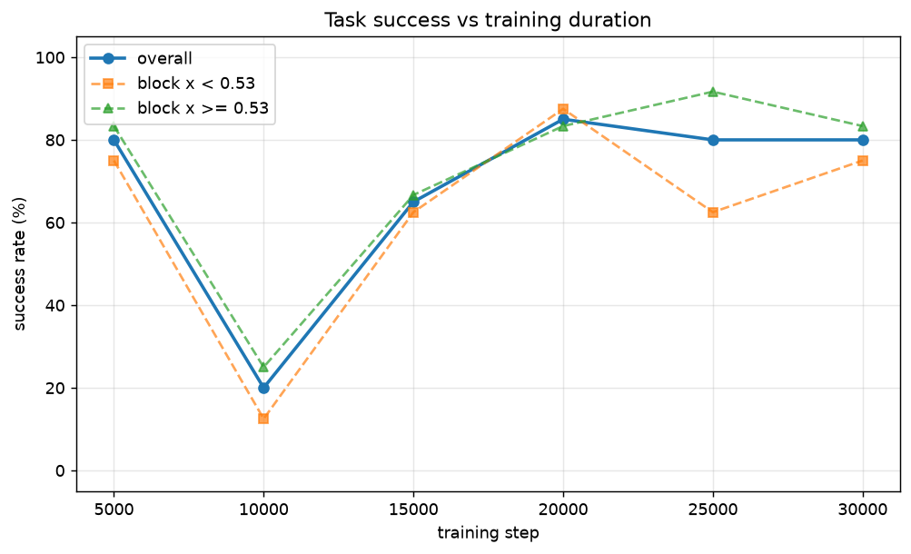
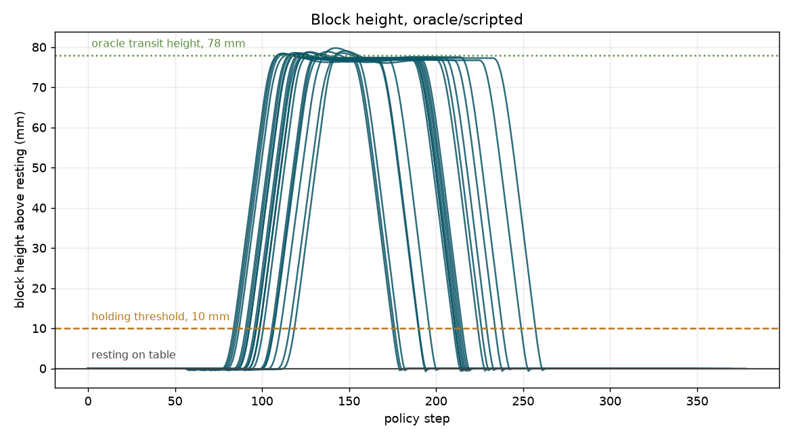

# FR3 Pick-and-Place: Simulation to Trained Policy

This project builds a full robot learning pipeline on Windows.

It has four parts. A Cartesian impedance controller for a 7-DOF Franka FR3
arm in MuJoCo. DualSense teleoperation to collect demonstrations. Imitation
learning with ACT and Diffusion Policy. And an evaluation harness that
measures task success rate instead of loss.

Everything runs natively on Windows.

---

## Results

The block spawns anywhere in an 18 × 18 cm region. Headline numbers come
from at least six seeds of 100 trials each, and the seeds used to report a
result are never the ones used to pick its checkpoint.

### The success criterion changed partway through this project

**Read this before the tables.** Every success rate in the historical
section was measured with `check_success`: the block ends resting within
5 cm of the target. That criterion does not ask whether the robot picked the block up,
whether it let go, whether it let go gently, or whether it did any of it at
a speed a person would recognise.

This project already knew that was insufficient. Stage 2 found five separate
reward exploits, four of them in policies reporting 99% or better, and every
one of them satisfied `check_success` while doing something the criterion
could not see: shoving the block across the table, dropping it from 95 mm,
or ending with it gripped in mid-air. Those lessons were written into
`eval_teacher.py` for the RL teacher and **never applied to the vision
student**, so the ACT and diffusion tables in the historical
section use the criterion the project had already proven certifies the
behaviours it rejects.

`src/eval/strict.py` replaces it with nine gates covering the whole
specified sequence — approach, grasp, lift, carry, descend, gentle release,
lift off, return home — scored against bands measured from all 221 recorded
demonstrations. See **[docs/STRICT_EVAL.md](docs/STRICT_EVAL.md)**.

The gap is not cosmetic:

| policy | loose `check_success` | **strict** |
|---|---|---|
| scripted oracle | 100.0% | **100.0%** |
| oracle driven at 3× demonstration speed | 100.0% | **0.0%** |
| ACT, the 86.8% policy, seed 61 | 92.5% | **72.5%** |

The middle row is the point. Identical waypoints, identical controller, only
the speed changed: it passes the old criterion on every trial and fails the
new one on every trial.

### Current best, measured on the strict criterion

Trained on 997 oracle-only episodes whose labels were corrected as described
in `docs/PATH_TO_97.md`. Every row is reported on seeds that played no part
in choosing its checkpoint.

| policy | loose | **strict** | n |
|---|---|---|---|
| previous best (`act_oracle_v1`, the 86.8% headline) | 92.5% | 72.5% | 40 |
| `act_oracle_v2`, ResNet18, chunk 32 | 96.7% | 92.3% ± 2.6% | 600 |
| `act_chunk64`, ResNet18, chunk 64 | 92.7% | 90.2% ± 1.1% | 600 |
| `act_r34`, ResNet34, chunk 32 | 95.0% | 93.0% ± 1.3% | 600 |
| `act_chunk64` + the two above, three-policy ensemble | — | 92.0% | 200 |
| `act_oracle_v2` + `act_r34`, seeds 71-86 | 98.2% | 97.0% | 1,200 |
| `act_oracle_v2` + `act_r34`, seeds 101-116 | 97.4% | 95.75% | 1,200 |
| `act_oracle_v2` + `act_r34`, all 24 seeds | 97.8% | 96.38% | 2,400 |
| `act_aux_xy` alone, auxiliary block-position target | 97.5% | 96.50% | 200 |
| **`act_oracle_v2` + `act_aux_xy`, 12 never-used seeds** | **99.0%** | **98.83%** | **1,200** |

**98.83% strict, 95% confidence interval 98.23 to 99.44**, pooled over
twelve seeds of 100 trials that had never been used for anything. Per seed
100/98/98/98/98/98 · 98/100/100/100/99/99, sd 0.90.

Against the previous best of 96.38% over 2,400 trials that is **+2.46
points, standard error 0.49, z = 5.00** — significant at any conventional
level. The scripted demonstrator scores 99.70%, so the student is now
**0.87 points behind its teacher** rather than 2.7.

The second member, `act_aux_xy`, is the auxiliary-supervision idea that had
been built and validated in `docs/PATH_TO_97.md` S5 and never run. It adds
the block's x and y to the action vector as extra regression targets, so
the representation is required to carry the block's position rather than
merely permitted to. Its effect was exactly the one predicted from the
clearance budget below: maximum lateral offset fell from 29.75 mm to
14.38, and the clearance minimum went from **−12.87 mm to +1.41**.

On its own it is **not** significantly better than the baseline — 96.50%
against 94.00% on identical trials, exact McNemar **p = 0.36**. What makes
it valuable is that its failures are **disjoint** from the baseline's: of
200 paired trials, 12 fail only under the baseline, 7 only under the aux
policy, and **none fail under both**. The baseline's failures all sit at
high block yaw offsets, the aux policy's at low ones. Averaging two
policies that fail in different places is the one situation where an
ensemble beats either, which is why this pairing gains 2.5 points where a
third `act_chunk64` member lost five.

The yaw is **not** supervised, deliberately: it is unreadable from these
cameras (see below), and a target the input does not contain adds an
unlearnable term to the loss. The aux target did trade some orientation
accuracy for the position gain — median commanded yaw error rose from
2.31° to 4.10° — which is why the jam count barely moved even though the
clearance tail was repaired.

> **This supersedes a 97.0% headline.** That figure was 1,164/1,200 on
> seeds 71-86. Twelve further seeds that had never been used for anything —
> 101-106 and 111-116 — give **95.75%**, 1.25 points lower. The standard
> error of that difference is 0.76 points, so z = 1.64 and the gap is *not*
> significant at the 5% level; nothing was fitted to the earlier seeds and
> the earlier measurement was not wrong. What it shows is that **1,200
> trials cannot quote a strict rate to the tenth of a point**: two clean
> 1,200-trial measurements of one unchanged policy landed 1.25 points
> apart. The best estimate is now the 2,400-trial pool.

Per seed, all 24: 98/97/97/99/97/97 · 96/100/96/96/97/94 ·
95/97/94/95/97/94 · 97/96/98/98/94/94.

A third ensemble member makes it **worse**, not better: adding
`act_chunk64` @ 27,500 takes 97.0% to 92.0% on the same 200 trials. It
replans on a 64-step cadence against the others' 32, so averaging the three
produces an incoherent plan rather than a better one. Ensembling worked
because two policies failed in *different regions*, and that is not a
property more members supply automatically.

The three single policies differ by 2.8 points with standard errors near 1,
so **architecture is not the binding constraint** and none of them passes
93%. What closes the gap is that two of them fail in different places:
ResNet18 is 6.8 points better near the base and ResNet34 is 5.4 points
better far from it, on identical data. Averaging their target poses — and
*voting* rather than averaging the binary gripper, which would otherwise
land exactly on the closed/open threshold whenever they disagree — gives a
policy with no regional weakness at all.

Two honest qualifications. The interval straddles 97%, and separating 97%
from 96% would need the 1,500 to 2,000 trials this README estimates
elsewhere, so the claim is "approximately 97%", not "provably above". And
the ensemble runs two policies per step, so inference costs about 5.6 s per
trial against a single ACT's 2.8 s.

For scale, the scripted oracle that generated the training data scores
**99.7% strict** under the same jitter, measured over 1,000 trials. The
student is **2.7 points behind its teacher**, and the gap lives entirely in
the student.

> **This corrects an earlier claim.** Until `docs/PATH_TO_99.md` was
> written, this section read "the scripted oracle scores 97.5% strict. The
> student has effectively caught its teacher, which means further gains
> need a better demonstrator rather than a better student." That 97.5% was
> `39/40` — forty trials, against a protocol this repository states
> elsewhere as "20 trials is ±11% and 100 is ±4%". Remeasured over 1,000
> trials the teacher is at 99.7%, three failures in a thousand. The two
> interventions that conclusion recommended — collect at lower jitter,
> filter the training set to strict-clean episodes — were aimed at a
> problem that does not exist, and the demonstrations are not the limiting
> factor.

#### What that looks like



The top panel is the plot that matters, and it is the one that caught four
separate reward exploits earlier in this project. A correct episode reads
flat on the table, one clean rise to about 80 mm, a plateau through the
carry, one clean descent, and **flat afterwards**, because the arm retreats
without disturbing what it put down. A shove would never leave the table. A
drop would fall. A hover would never come back down.

The three failures on this seed are drawn in red and are all the same
failure: the block never left the table by more than 20 mm, so the grasp
never happened, and the episode ran out the 600-step clock. That is the
residual failure mode, and it is the one the project has been chasing since
Stage 0 measured it at 62% of failures with zero near misses.

#### What the residual failure actually is

"The grasp never happened" is a correct description and it names no
mechanism. `docs/PATH_TO_99.md` takes it apart over 200 instrumented
trials. In order:

1. The policy's commanded **wrist yaw** is under-rotated, by a constant
   fraction of the rotation the block asks for: `error = 0.115 × offset`,
   r = 0.476, and the ratio holds across every bin from 0 to 45 degrees.
   This is shrinkage toward the mean, not a failure at one particular
   angle.
2. So the error grows with the rotation required. At 40 to 45 degrees of
   block yaw offset it averages 5.5 degrees and reaches 18.3.
3. Past a few degrees the open fingers cannot straddle a 44 mm cube. One
   comes down on its top face and **the descent jams** — the tool sits at
   +21.9 mm above the block's centre, which is exactly its top face, moving
   0.01 to 0.08 mm per step against 1.2 to 1.5 in a free descent, with the
   fingers wide open.
4. The policy is meanwhile commanding the descent **correctly**, target at
   −3.5 mm relative to the block, and tracking the commanded orientation to
   0.4 degrees with both wrist joints at a fifth of their range. The arm is
   not mistimed and the controller is not at fault.
5. The fingers then close where the arm stopped, which is the "+21.6 mm"
   that `PATH_TO_97.md` S17 identified as the defect. It is the symptom.

Failures therefore concentrate at large block yaw offsets — 0 of 122 trials
below 30 degrees, and 7.7% above — which is why they look random when
binned by block *position*, where they show no pattern at all.

Steps 1 to 3 are **two terms of one budget**, and that is why four separate
single-variable explanations — timing, lateral offset, the cube's symmetry
boundary, the wrist yaw — each looked right on a handful of trials and each
failed at scale:

```
clearance = 40 mm − ( lateral offset + 22·(cos e + sin e) )
```

a finger face sits 40 mm from the tool centre when open, and a 44 mm cube
at yaw error `e` presents `22(cos e + sin e)` of half-extent. Every jam in
200 trials sits under **6 mm** of clearance against a median of 12, and
11 trials are in that band of which 4 jam — a 36% failure rate against a 2%
base rate. Neither term separates on its own.


This rules out a class of fixes rather than suggesting one.

* A runtime layer that refuses the mistimed close and forces a replan was
  built and measured in six configurations: **all six score 97.00% and fail
  the same six trials.** Refusing a close does not unjam an arm, and
  replanning returns the same plan from the same observation.
* Correcting the wrist yaw using the block's **true orientation from the
  simulator** — no perception error at all — takes 97.0% to **96.0%**. It
  rescues the two jams whose extent term is large, does nothing for the one
  at 0.8° of yaw error, and breaks four trials that previously passed by
  walking the policy off its training distribution.
* The block's yaw is **not recoverable from these three camera views**:
  a purpose-built estimator trained on 6,500 non-leaky samples sits at
  22.3° median error at 160×128 and 21.4° at 320×256, against a chance
  level of 22.5°. `PATH_TO_97.md` S3 ruled resolution out on *position*
  evidence, and position is legible to 3.1 mm; yaw had never been measured.

#### The budget accounts for the whole gap to the teacher

The demonstrator scores 99.7% and the student 96.4%. Running the oracle
through the same instrumentation — it needs no images, so 400 trials cost
nothing — shows the difference is a distribution's **tail**, not its centre:

| at descent onset | **teacher**, n=400 | **student**, n=200 |
|---|---|---|
| clearance, **minimum** | **+6.40 mm** | **−8.83 mm** |
| clearance, p5 | 11.94 mm | 5.08 mm |
| clearance, median | 14.91 mm | 12.03 mm |
| **trials under 6 mm** | **0 (0.00%)** | **12 (6.00%)** |
| jams | **0** | 4 |
| lateral offset, median / max | 3.09 / 11.60 mm | 5.21 / **21.37** mm |
| commanded yaw error, median / max | **0.00 / 0.00°** | 2.14 / **33.05°** |

The teacher's worst trial in 400 has more clearance than the student's
fifth percentile, and it never enters the band where every student jam
happens. The median clearances differ by only 2.88 mm.

**The budget is monotone across every policy measured, and it predicted the
98.83% result before the success rate could confirm it:**

| policy | strict | **p5 clearance** | under 6 mm | jams |
|---|---|---|---|---|
| `act_oracle_v2` alone | 92.00% | 1.83 mm | 17.50% | 4 / 200 |
| `act_oracle_v2` + `act_r34` | 97.00% | 5.08 mm | 6.00% | 4 / 200 |
| **`act_oracle_v2` + `act_aux_xy`** | **98.83%** | **7.08–7.32 mm** | 2.50–3.00% | 6 / 1,200 |
| scripted demonstrator | 99.70% | 11.94 mm | 0.00% | 0 / 400 |

This is why it is the quantity to tune on. A strict rate needs thousands of
trials to resolve a point — two clean 1,200-trial measurements of one
unchanged policy landed 1.25 points apart — whereas p5 clearance is
continuous, measurable on 200 trials, and spans 1.83 to 11.94 mm across
policies covering under eight points of success. `clearance_report.py`
computes it from any monitor-mode run.

This also validates the 6 mm threshold rather than fitting it: it was
derived from 4 jams against 194 passes in one population, and a second,
unseen population independently never goes below 6.40 mm and never jams.

So the lateral term is the one with room in it — position is legible to
3.1 mm — and the auxiliary block-position target built and validated in
`PATH_TO_97.md` S5 and never used is aimed exactly at it. That is the next
run this evidence supports, and it gives a target a single training run can
be scored against without waiting on a 1,200-trial success rate that cannot
resolve a point: **raise the student's fifth-percentile clearance from
5.08 mm toward the teacher's 11.94.**

A 20-trial sample on a different held-out seed is in
[docs/proof_ensemble_20trials.png](docs/proof_ensemble_20trials.png).

Regenerate either with:

```powershell
python -m src.scripts.proof_report `
  --ensemble outputs/_keep/act_oracle_v2_030000/pretrained_model `
             outputs/_keep/act_r34_025000/pretrained_model `
  --trials 100 --seed 92 --tag proof_ensemble_100trials
```

#### Trained weights

The two checkpoints that make up the ensemble are published on the
[releases page](https://github.com/Himanshu12328/fr3-pick-place/releases),
since datasets and training outputs are not tracked in the repository. Each
archive holds the `pretrained_model` directory only, which is what inference
needs; optimiser state for resuming training is not included.

The change that produced it was not architecture, resolution or scale. The
training labels had been collected with the reactive DAgger labeller, whose
fixed 12 mm target lead produces one flat speed for the whole episode
instead of the demonstrations' deliberate 1.85 / 3.27 / 4.78 mm-per-step
profile. The retreat was 1.7× too slow. Collecting with the rate-limited
phase machine instead took the dataset's own trajectory score from 0.832 to
0.974, and the policy followed.

Mean lift is 80 mm, exactly the demonstrations'. The block moves 0.22 mm
after release. The far-region deficit that had persisted through every
earlier stage is gone.

Two further interventions were tried on top of this and both were negative,
which is why the policy above is the deliverable:

| intervention | result |
|---|---|
| replanning more often (`n_action_steps` 32 to 16 to 8) | 92.5% to 85.0% to 32.5% strict |
| DAgger, 285 on-policy episodes mixed into the 997 | 92.5% to 65.0% strict |

The DAgger result is a controlled one. Same architecture, same 30,000 steps,
same learning rate, only the dataset differs. Two labelling bugs were found
and fixed first, and the dataset passed every composition check including
the two that destroyed the Stage 3 attempt, so this is a result about DAgger
data in a chunked-policy training set rather than another bug. The leading
explanation is that ACT is trained to predict 32 actions that actually
follow an observation, and DAgger supplies 32 per-step corrections computed
from states the student reached, which never form the path the images go on
to show.

Work towards a strict-criterion result is tracked in
**[docs/PATH_TO_97.md](docs/PATH_TO_97.md)**, including every negative
result and all ten defects found along the way, five of which were in the
new evaluation harness itself and were found by using it.

The single change that produced the gain is worth stating plainly, because
it was not the one that was planned. The approved plan was higher image
resolution, a larger backbone and auxiliary supervision. A probe showed the
block position is already legible from the 160x128 images to 3.1 mm, so
resolution was dropped. What was actually wrong was that the training labels
had been collected with the reactive DAgger labeller rather than the
rate-limited phase machine. A fixed 12 mm target lead produces one constant
speed, so the demonstrations' deliberate slow-fast-slow profile was absent
from every label and the retreat was 1.7 times too slow. Re-collecting with
the phase machine took the dataset's trajectory score from 0.832 to 0.974
and the policy from 72.5% to 92.3% strict.

### Earlier results, all on the loose criterion

Everything from here to the end of this section predates the strict
criterion and is kept for the record. Read every number in it as "put the
block near the target by any means", not as "performed a pick and place".
The one policy from this era that was re-measured, `act_oracle_v1`, lost
20 points when scored properly.

#### 151 demonstrations

| Policy | Best checkpoint | Success rate | Per-seed |
|---|---|---|---|
| ACT | 20,000 steps | **77.2% ± 5.0%** | 78 / 74 / 85 / 70 / 77 / 79 |
| Diffusion Policy | 20,000 steps | **71.3% ± 5.9%** | 80 / 63 / 69 / 68 / 74 / 74 |

Pooled, that is 463 out of 600 for ACT and 428 out of 600 for diffusion.
The 5.9 point gap has a standard error of 2.5 points. At this sample size
ACT is ahead by a meaningful margin. This is the first time the two
architectures separate in this project.

Both policies saw identical block placements on each seed, so the comparison
is paired.

This result applies to this task, this dataset and these checkpoints. It is
not a general claim about the two architectures.

#### 221 demonstrations, near-region bias

The 151-episode results below showed both policies were 14 to 21 points
weaker when the block started near the base (`x < 0.53`). Two explanations
were possible: the region was under-sampled, or it was genuinely harder to
control. 70 additional episodes were collected with `--bias-near`,
restricting placements to `x < 0.53`, and mixed with the original 151 for a
221-episode dataset. Evaluation still samples the full range uniformly, so
this changes only what the policy trains on, not what it is scored on.

| Policy | Best checkpoint | Success rate | Per-seed |
|---|---|---|---|
| ACT | 20,000 steps | **83.5% ± 4.2%** | 80 / 80 / 90 / 80 / 86 / 85 |
| Diffusion Policy | 50,000 steps | **83.2% ± 4.4%** | 83 / 81 / 78 / 89 / 80 / 88 |

**The near-region gap closed for both policies — reversed for ACT, flattened for diffusion.**

| Region | ACT, 151 eps | ACT, 221 eps | Diffusion, 151 eps | Diffusion, 221 eps |
|---|---|---|---|---|
| x < 0.53 m (near) | 67.9% (n=209) | **87.8%** (n=238) | 57.9% (n=209) | **82.4%** (n=238) |
| x ≥ 0.53 m (far) | 82.1% (n=391) | 80.7% (n=362) | 78.5% (n=391) | 83.7% (n=362) |
| gap | -14.2 | **+7.1** | -20.6 | **-1.3** |

Adding 70 episodes to only the near region moved only the near region — the
far side held steady within noise for both policies. That is close to a
controlled experiment for "was this a coverage problem," and the answer is
yes, not a control-geometry limit.

Diffusion's near-region result carries a second finding: it was not just
weak before, it was wildly unstable there. Across the six 151-episode seeds
its near-region rate ranged 41.9 to 77.8 percent, a 36-point spread on the
same checkpoint. At 221 episodes that range is 78.6 to 87.8 percent, a
9.2-point spread. The extra data fixed the mean and the variance.

This also recalibrates the sweep-overestimate finding for both policies: the
checkpoint-selection sweeps (n=20) picked 90% for ACT at step 20,000 and 90%
for diffusion at step 50,000; the six-seed numbers are 83.5% and 83.2%, gaps
of 6.5 and 6.8 points, both consistent with the 5-to-7-point pattern already
established below.




#### Data scaling

| Dataset | ACT | Diffusion Policy |
|---|---|---|
| 71 episodes | 58.7% ± 8.1% | 62.7% ± 3.8% |
| 151 episodes | 77.2% ± 5.0% | 71.3% ± 5.9% |
| 221 episodes | **83.5% ± 4.2%** | **83.2% ± 4.4%** |

Doubling the dataset from 71 to 151 moved both policies. ACT gained 18.5
points and diffusion gained 8.6. Going from 151 to 221 — mostly a targeted
addition to one region rather than general coverage — moved ACT a further
6.3 points and diffusion 11.9. Diffusion gained more from the same 70
episodes, consistent with its pre-intervention near-region deficit being
larger to begin with (20.6 points against ACT's 14.2).

It also changed when they converge. On 71 episodes ACT peaked at 5,000 steps
and diffusion at 40,000. On 151 episodes both peak at 20,000.

The ordering flipped too. At 71 episodes diffusion led by 4 points, which
was well inside the noise. At 151 episodes ACT leads by 5.9 points with six
seeds behind it. The earlier ordering was never real. Three seeds establish
very little.




#### Other differences between the two

**ACT is 9× cheaper to run.** It takes 2.8 s per evaluation trial against
26 s for diffusion. ACT does one transformer forward pass per action chunk.
Diffusion does 100 DDPM denoising steps every 8 actions. On real hardware at
30 Hz that difference decides whether the policy runs at all.

**ACT imitates more precisely.** Teacher-forced mean position error is
4.2 mm against 6.1 mm. Grasp-phase error is 1.5 to 3.0 mm against 5.3 to
6.4 mm. ACT's gripper timing is within one frame with no spurious toggles.
Diffusion's predictions oscillate, and it opens and closes the gripper
several times near release where the demonstration opens once.

#### Known limitations, as they stood then

**Both policies are weaker near the base.** Splitting all 600 trials per
policy by where the block started:

| Region | ACT | Diffusion | n |
|---|---|---|---|
| x < 0.53 m | 67.9% | 57.9% | 209 |
| x ≥ 0.53 m | 82.1% | 78.5% | 391 |
| **gap** | **14.2** | **20.6** | |

Both policies do worse when the block sits closer to the base. Diffusion is
worse than ACT there. The gap survives six seeds for each policy, so it is
not sampling noise.

Diffusion's near-region performance is also very unstable. Across the six
seeds it scored 41.9, 44.4, 50.0, 69.0, 71.0 and 77.8 percent. That is a
36 point range on the same checkpoint. A policy that swings that far
depending on which placements it draws is not one to deploy.

There were two possible causes, needing different fixes. The near region
may simply have been under-represented — the block distribution is centred
at x = 0.55 while the split sits at 0.53, so only about 35% of placements
fell below it. Or the near region may be harder to control, since the arm
folds in closer to the base there.

**Resolved: it was coverage, not control geometry, for both policies.** See
[221 demonstrations, near-region bias](#221-demonstrations-near-region-bias)
above — 70 episodes collected with `--bias-near` took ACT's near-region
success from 67.9% to 87.8% and diffusion's from 57.9% to 82.4%, while the
untouched far region held steady for both. Diffusion's near-region result
was also wildly unstable before (36-point spread across seeds) and is not
after (9.2-point spread).

```powershell
fr3-collect --bias-near
```

**The y split is flat.** Both policies score 70 to 80 percent on either side
across all twelve runs. An earlier idea that the operator-side region was
harder came from eyeballing failure logs. Twelve seeds killed it.

**Training success is not monotonic.** This happens in both architectures.
ACT scored 80% at 5k steps, then **20% at 10k**, then 65% at 15k, then 80 to
85% from 20k onward. Diffusion scored 80% at 20k, then **45% at 30k**, then
recovered to 65 to 70%.

The ACT 10k checkpoint had a teacher-forced fit error of 16 to 18 mm, where
the checkpoints either side had a few millimetres. So the model really did
pass through a bad phase. It was not just rolling out badly. A
single-checkpoint evaluation at either of those steps would have reported
the whole pipeline as broken.

**Sweep peaks over-report by 5 to 7 points.** This was measured four times:
65 → 58.7, 70 → 62.7, 85 → 77.2, 80 → 71.3. The sweep is the right way to
find a good checkpoint. It is the wrong way to report how good that
checkpoint is, because the checkpoint gets chosen on the same placements it
is then scored on. Every headline number here comes from re-evaluating the
chosen checkpoint on fresh seeds.

**Fit quality does not predict task success.** On the 71-episode dataset,
ACT's teacher-forced error fell from 26 mm to 6.8 mm between step 5k and
55k. Its success rate did not move at all over that range.

Training loss is an even weaker signal. Diffusion's loss declined smoothly
while its success rate swung between 10% and 80%. Only rollout evaluation
finds the peak. That is why the harness exists, and why it is validated
against recorded demonstrations before any policy is trusted.

---

## Requirements

* Windows 10 or 11
* An NVIDIA GPU. Built and tested on an RTX 5080 (Blackwell, sm_120)
* Python 3.11
* A DualSense controller, if you want to collect new demonstrations
* About 80 GB free disk for a 150-episode dataset at 640 × 480

---

## Setup

### 1. Python

Install Python 3.11 from python.org. Do not use the Microsoft Store build.
It sandboxes paths and breaks venv activation. Check "Add python.exe to
PATH" during install.

### 2. Clone and create the environment

```powershell
git clone https://github.com/<your-username>/fr3-pick-place.git
cd fr3-pick-place
py -3.11 -m venv .venv
.\.venv\Scripts\Activate.ps1
```

If activation is blocked:

```powershell
Set-ExecutionPolicy -Scope CurrentUser -ExecutionPolicy RemoteSigned
```

### 3. Install PyTorch first, on its own

Install PyTorch before anything else. That way no other package can pull in
a wrong CUDA build as a dependency.

```powershell
pip install --upgrade pip
pip install "torch==2.10.0" "torchvision==0.25.0" --index-url https://download.pytorch.org/whl/cu128
```

**Blackwell GPUs need the cu128 index.** Standard PyPI wheels have no sm_120
kernels. Verify both of these before you continue:

```powershell
python -c "import torch; print(torch.__version__, torch.cuda.is_available(), torch.cuda.get_device_capability())"
python -c "import torch; a=torch.randn(4096,4096,device='cuda'); print((a@a).sum().item())"
```

The first must print `(12, 0)`. The second must print a number. If
`cuda.is_available()` returns True that does not prove the kernels exist.
Only the matmul proves it.

### 4. Install the project

```powershell
pip install -e ".[train]"
```

Confirm the whole stack imports together:

```powershell
python -c "import torch, numpy, mujoco, lerobot; print(torch.__version__, numpy.__version__, mujoco.__version__, lerobot.__version__)"
```

### 5. Get the robot model

```powershell
git clone https://github.com/google-deepmind/mujoco_menagerie
```

Or set `MENAGERIE_DIR` if you keep it somewhere else.

### 6. Turn on Developer Mode

Go to Settings, System, For developers, and turn **Developer Mode** on.
LeRobot writes a symlink when it saves a checkpoint, and Windows refuses
symlinks without this. Training will otherwise crash at the first
checkpoint, hours into the run.

### 7. Point Python at the discrete GPU

Go to Settings, System, Display, Graphics. Add a desktop app. Browse to
`.venv\Scripts\python.exe`. Set it to **High performance**. Also turn off
Windows Energy Saver, which quietly caps the GPU.

This step is not optional and it is not obvious. Without it MuJoCo's
offscreen renderer falls back to Microsoft's software rasterizer. That is
**48 ms per frame instead of 0.8 ms**, a 60× penalty.

The interactive viewer works fine either way, because windowed OpenGL takes
a different path. So a smooth viewer is not evidence that headless rendering
is on the GPU. Measure it.

### 8. Build the scene

```powershell
fr3-build-scene
python -m src.scripts.preview_cameras
```

This takes Menagerie's bare FR3 and adds a parallel-jaw gripper, a table, a
graspable block, and three cameras. It writes
`models/fr3_pick_place.xml`. The verify output should say
`nq=16 nv=15 nu=7`.

---

## Pipeline

### Phase 1: Impedance controller

This is a Cartesian impedance controller with nullspace posture regulation:

```
tau = J^T (Kp * pose_error - Kd * ee_velocity)     task space
    + N (Kp_n * posture_error - Kd_n * qvel)       nullspace
    + qfrc_bias                                    gravity + Coriolis
    - qfrc_passive                                 model damping
```

Damping is recomputed every step from the task-space inertia, using
`Kd = 2ζ√(Λ·Kp)`. This keeps the damping ratio at ζ no matter how the arm
is configured. Apparent tip inertia varies by more than 10× across the
workspace. That is why fixed damping gains feel right in one pose and mushy
in another.

Adding the 0.8 kg gripper changed the measured bandwidth and overshoot by
less than half a point at every damping ratio. The inertia-scaled damping
absorbed the mass change, which is exactly what it is for.

**Interactive feel test:**

```powershell
python -m src.scripts.impedance_hold
```

Use `WASD` and `QE` to move the target. Use `[` and `]` to change stiffness.
Press `n` to toggle the nullspace term. Push the elbow while watching the
tip. With nullspace on, the elbow moves and the tip stays put.

**Quantitative characterisation:**

```powershell
python -m src.scripts.tune_step
```

| Use | Kp (N/m) | ζ | Bandwidth | Overshoot |
|---|---|---|---|---|
| Transit | 800 | 0.7 | 1.5 Hz | 3.2% |
| Contact | 300 | 1.0 | 0.5 Hz | 0.8% |


### Phase 2: Teleoperation and data collection

```powershell
python -m src.scripts.test_pad      # check the controller mapping first
fr3-collect
fr3-collect --bias-near             # sample only x < 0.53, the weak region
```

**Controls.** Left stick moves in x and y. L2 and R2 move down and up. Right
stick pitches and yaws. L1 and R1 roll. Square and Cross close and open the
gripper. D-pad Up starts recording, Right saves, Down discards.

Stick deflections are integrated into an **absolute target pose**. That pose
is what gets logged as the action.

This choice matters. The impedance controller takes target poses as input.
So the same controller works for both data collection and policy inference,
with no changes. If you logged velocities instead, you would need a
different interface at inference time.

The gripper is **binary**, either fully open or fully closed. A rigid cube
has no use for intermediate openings. A continuous target gets averaged
across demonstrations into a gradual closure that clips the block. And
binary matches what VLA action heads are pretrained on.

**Validate before you collect hundreds:**

```powershell
fr3-validate
python -m src.scripts.inspect_episode --batch 4
```

`validate_data.py` reports the speed and maximum per-step jump of every
episode. Watch these across a session.

Over 151 episodes the mean speed drifted from about 74 mm/s to about
103 mm/s as the operator got faster. `maxjump` settled at exactly 7.00 mm,
which means both sticks at full deflection. So the later demonstrations are
almost all bang-bang diagonal moves.

The scaling gain shows this did not hurt. But it is the kind of drift worth
noticing while it happens, not afterwards.


### Phase 3: Training

Re-render at training resolution first. This is not optional if you care
about throughput:

```powershell
fr3-rerender
fr3-to-lerobot
```

`rerender.py` replays each episode's recorded actions through the simulator
and re-renders every camera at 128 × 160. The state arrays hold all joint
angles, so the scene at any frame can be reconstructed exactly. No data gets
re-collected. Joint drift after replay stayed under 0.005 rad across a
400-step episode, on all 151 episodes.

Here is why this matters. At 640 × 480 the dataloader spent **0.97 s per
step** decoding and resizing PNGs, while the GPU update took only 0.13 s.
The GPU sat idle 88% of the time. After re-rendering, `data_s` drops to
about 0.1 and training runs 7× faster.

**Train ACT:**

```powershell
$env:PYTHONIOENCODING="utf-8"

lerobot-train `
  --dataset.repo_id=local/fr3_pick_place_small `
  --dataset.root=.\data\lerobot\local_fr3_pick_place_small `
  --dataset.image_transforms.enable=true `
  --policy.type=act `
  --policy.device=cuda `
  --policy.use_amp=true `
  --policy.chunk_size=32 `
  --policy.n_action_steps=32 `
  --policy.n_obs_steps=1 `
  --policy.kl_weight=1.0 `
  --policy.optimizer_lr=1e-4 `
  --policy.optimizer_lr_backbone=1e-5 `
  --policy.push_to_hub=false `
  --batch_size=64 `
  --steps=30000 `
  --save_freq=5000 `
  --output_dir=.\outputs\act_v3 `
  --job_name=act_v3
```

You need `PYTHONIOENCODING=utf-8` because LeRobot prints policy names
containing characters that crash the Windows cp1252 console.

**ACT's default learning rate of 1e-5 is too low for this data scale.** That
default was tuned for ALOHA's bimanual tasks, with hundreds of episodes and
100k or more steps. On 71 episodes, 1e-5 reached 43 mm fit error at 20k
steps. A rate of 1e-4 reached 26 mm at 5k. Keep the backbone at 1e-5 so the
pretrained ImageNet features survive.

**Train Diffusion Policy:**

```powershell
lerobot-train `
  --dataset.repo_id=local/fr3_pick_place_small `
  --dataset.root=.\data\lerobot\local_fr3_pick_place_small `
  --dataset.image_transforms.enable=true `
  --policy.type=diffusion `
  --policy.device=cuda `
  --policy.use_amp=true `
  --policy.crop_shape="[115,144]" `
  --policy.horizon=16 `
  --policy.n_action_steps=8 `
  --policy.n_obs_steps=2 `
  --policy.down_dims="[256,512,1024]" `
  --policy.optimizer_lr=1e-4 `
  --policy.push_to_hub=false `
  --batch_size=64 `
  --steps=60000 `
  --save_freq=10000 `
  --output_dir=.\outputs\diffusion_v3 `
  --job_name=diffusion_v3
```

---

## Evaluation

The harness runs the policy in the same simulator, with the same impedance
gains, the same block distribution, and the same success criterion used to
label the demonstrations. That shared definition is what makes the number
comparable to anything.

**Validate the harness itself first:**

```powershell
python -m src.scripts.test_harness
```

This replays recorded actions from ten episodes. All ten should succeed. If
they do not, the harness has drifted away from the collection environment.
Every success rate it reports would then be wrong in the same invisible way.

**Check the plumbing before you spend time on trials:**

```powershell
fr3-eval --run act_v3 --checkpoint 020000 --type act --check
```

This compares the policy's prediction against a recorded action on a
training frame. Expect a few millimetres of error. If the predictions sit
between -1 and 1, the postprocessor is not being applied and the action is
still normalised.

**Find the best checkpoint:**

```powershell
fr3-sweep --run act_v3 --type act --trials 20
```

**Then re-evaluate that checkpoint on fresh seeds.** The sweep peak is
optimistic by 5 to 7 points, because the checkpoint was chosen on the same
placements it was scored on. Six seeds of 100 trials is what the headline
numbers above are built from:

```powershell
python -m src.scripts.region_analysis --run act_v3 --checkpoint 020000 --type act --trials 100 --seed 41
```

`region_analysis` also splits the result by where the block started. That is
how the near-workspace weakness was found.

**Diagnose a failing policy:**

```powershell
python -m src.scripts.replay_predict --run act_v3 --checkpoint 020000 --type act
```

This feeds a recorded episode's observations through the policy. It plots
the predicted action trajectory against the recorded one, with per-phase
error and gripper timing.

It is teacher-forced, so it measures fit rather than closed-loop behaviour.
But it separates two very different problems: the policy never learned the
task, versus the policy learned it and drifts during rollout. A success rate
alone cannot tell those apart.


---

## Repository layout

```
src/
  config.py                    Paths and shared constants
  controllers/impedance.py     Cartesian impedance controller
  teleop/dualsense.py          Pad reader and target-pose integrator
  data/recorder.py             Episode buffering and disk format
  data/task.py                 Block randomisation and success criterion
  eval/rollout.py              Rollout harness
  eval/policy_wrapper.py       LeRobot policy and processor adapter
  scripts/                     Entry points, one concern each
tests/                         Invariants whose violation is silent
docs/                          Result plots used in this README
```

---

## Data format

Episodes get written as raw directories first. They are converted to
LeRobotDataset later, as a separate offline step.

That separation is deliberate. LeRobot's dataset API changes between
versions. A collection session should never be lost to a library upgrade.

```
observation.state    (16,)  7 joint pos, 7 joint vel, 2 finger pos
observation.images   three RGB streams
action               (8,)   target position 3, target quaternion 4, gripper 1
```

Design choices that make the data reusable across architectures:

* **Absolute target poses** instead of velocities, so one controller serves
  both collection and inference
* **Binary gripper**, which is what VLA action heads expect
* **A task string per episode**, needed for language-conditioned policies
* **Workspace bounds in the metadata**, so normalisation is reproducible
* **No block pose in the observation.** It is available in simulation but
  not on hardware, and a policy that reads it learns to skip perception

---

## Gotchas

Each of these cost real debugging time. All of them produced wrong results
that looked plausible, rather than raising an error.

**Evaluation resolution must match training resolution.** The vision
backbone is fully convolutional, so it accepts any input size without
complaint. But `crop_shape` is applied in pixels.

Rendering at 640 × 480 for a policy trained at 128 × 160 turns a
whole-scene 90% crop into a 115 × 144 patch of dead centre. The policy goes
effectively blind and runs on proprioception alone. This dropped measured
success from 60% to 0.4%. The tell was identical rollout distances across
different checkpoints and different architectures.

**MuJoCo's API moved.** `data.qM` was renamed to `data.M`. It still holds
the sparse packed lower triangle, not the dense matrix. And `mj_fullM`
changed signature from `(model, dst, src)` to `(model, data, dst)`. The
`mass_matrix()` function in `impedance.py` handles all three variants.

**`qfrc_bias` does not include passive joint forces.** It holds only
`C(q,q̇)q̇ + g(q)`. MuJoCo's joint damping and springs live in
`qfrc_passive` and get added separately. If you leave them uncompensated,
the model's damping stacks on top of the controller's, and the achieved
damping ratio is not the ζ you asked for.

**Dry friction cannot be cancelled feedforward.** Menagerie's FR3 sets about
6 Nm of total `frictionloss`. That produces a constant 6 N opposing force
and 22 mm of steady-state error at Kp=300.

It is resolved by the constraint solver, not readable as a force, so it gets
zeroed for controller characterisation. On real hardware it is real, and it
sets a minimum usable stiffness: `Kp × acceptable_error > 6 N`.

**DualSense mappings differ from the SDL documentation.** On this pad L1 and
R1 are buttons 9 and 10, not 4 and 5. Buttons 4 and 5 are Share and the PS
button.

Yaw also needs its sign flipped for front-of-arm operation. That is despite
the geometric argument that rotation should read the same from either
viewpoint. Verify both empirically with `test_pad.py` and `teleop_test.py`.

**Windows console encoding.** LeRobot prints policy names with non-cp1252
characters, which crashes the console. Set `PYTHONIOENCODING=utf-8`.

---

## Roadmap

* [x] Cartesian impedance controller, characterised on the full scene
* [x] DualSense teleoperation and demonstration collection
* [x] Evaluation harness, validated against recorded demonstrations
* [x] ACT and Diffusion Policy on 71 episodes, indistinguishable
* [x] Data scaling to 151 episodes. ACT **77.2% ± 5.0%**, Diffusion
      **71.3% ± 5.9%**, separated at 600 trials per policy
* [x] Selection bias quantified across four runs
* [x] Targeted collection at x < 0.53 m, where both policies were 14 to 21
      points weaker. Confirmed a coverage gap, not a control one, for both:
      near-region success went 67.9% → 87.8% for ACT and 57.9% → 82.4% for
      diffusion (221 episodes, six seeds each)
* [x] Stage 0. Measured the environment ceiling and classified the
      failures. The oracle scores 600/600, so the whole 16.5 point gap is
      learnable. ACT's failures are 62% missed grasps, 18% knocked away,
      20% dropped, and zero near misses
* [x] Stage 1. Temporal ensembling and action chunk length sweep. No
      configuration beat the baseline. Success collapses monotonically as
      the chunk shortens: 88, 85, 61, 26, 0 percent at 32, 16, 8, 4, 1
      action steps. The policy depends on open-loop chunk commitment
* [x] Stage 2. Teacher, at 100% over 600 trials and 0.991 trajectory
      similarity to the demonstrations. Eleven runs of RL produced nothing
      better than the scripted oracle from Stage 0, so the oracle is the
      teacher. Five reward exploits along the way, four of them reporting
      over 99% while shoving, hovering or dropping the block. See
      docs/RL_PROCESS.md
* [x] Stage 3. Distil the teacher into a vision only student with DAgger.
      200 oracle-labelled episodes on the student's own state distribution,
      merged with the 221 recorded ones. **76% against the 83.5% baseline,
      so it made the policy worse.** Plateaued from 15k to 30k steps
* [x] Stage 3b. Oracle demonstrations at scale. 800 machine-generated
      demonstrations mixed with the 221 recorded ones, 1,006 episodes and
      298k frames. **86.8% +- 3.7% over 600 trials against the 83.5%
      baseline**, the first approach of four that did not land below it.
      Predicted 88 to 93% beforehand, so it came in just under
* [x] Stage 3c. **The success criterion was replaced.** `check_success` is
      satisfied by a shove, a drop and a hover, which this project had
      already proven five times against RL teachers and never applied to
      the vision student. `src/eval/strict.py` scores the whole specified
      sequence against nine gates calibrated so all 221 recorded
      demonstrations pass. Validated both ways: the oracle scores 100%, an
      oracle at 3x speed scores 100% loose and **0% strict**. Every earlier
      number in this file is a loose number. See docs/STRICT_EVAL.md
* [x] Stage 3d. **The training labels were wrong.** Oracle collection had
      been using the reactive DAgger labeller, whose fixed 12 mm target
      lead produces one constant speed, so the demonstrations'
      slow-fast-slow profile was absent and the retreat ran 1.7x too slow.
      The dataset scored 0.832 against its own trajectory profile where the
      demonstrations score 0.994. Re-collected with the rate-limited phase
      machine: **0.974**. Also fixed a second bug where the phase machine
      ignored every jitter field, making it a deterministic demonstrator
* [x] Stage 3e. ACT on 997 corrected oracle-only episodes.
      **92.3% +- 2.6% strict and 96.7% loose over 600 trials** on seeds
      never used for selection, against the previous best policy's 72.5%
      strict. Mean lift 80 mm against the demonstrations' 80, block moved
      0.22 mm after release, far-region deficit gone
* [x] Stage 3f. Two controlled negative results. Replanning more often is
      monotonically worse (92.5, 85.0, 32.5 percent at 32, 16, 8 action
      steps). DAgger costs 27 points: 285 on-policy episodes added to the
      997 took the best checkpoint from 92.5% to 65.0% under an otherwise
      identical run, after two labelling bugs were fixed and the dataset
      passed every composition check
* [x] Stage 4. Closed the gap to 97%. Three architecture and horizon
      variants all plateaued at 90 to 93 percent, so capacity and chunk
      length are not the constraint. What worked was that two of them fail
      in *different places* — ResNet18 is 6.8 points better near the base,
      ResNet34 5.4 points better far from it, on identical data — so
      averaging their target poses, and voting rather than averaging the
      binary gripper, removes the regional weakness entirely.
      **97.0% strict over 1,200 trials, 95% CI 96.0 to 98.0**
* [x] Stage 5. Reported over twelve seeds of 100 trials, six of them
      contaminated only by having suggested the experiment and six never
      used for anything. The two sets differ by 1.0 point, which is noise;
      for contrast the chunk-64 experiment shrank by 6.0 points between its
      screening and reporting seeds and reversed sign
* [x] Stage 6. **Diagnosed the residual 3%, and ruled out the runtime fix
      for it.** The teacher was remeasured at **99.7% strict over 1,000
      trials**, not the 97.5% a 40-trial sample had reported, so the
      student is 2.7 points behind it and the gap is the student's. The
      residual failure is a wrist-yaw error that is *proportional* to the
      rotation the block requires — `error = 0.115 × offset`, holding
      across every bin from 0 to 45 degrees — which jams the descent on the
      block's top face. A runtime layer that refuses the mistimed close and
      forces a replan was built and measured in six configurations: **all
      six score 97.00% and fail the same six trials.** See
      docs/PATH_TO_99.md
* [ ] Beat the teacher. The 2.7 points to the demonstrator are the
      student's to close, and the levers that have been ruled out by
      measurement now are: a runtime supervisor (six configurations, no
      change), a third ensemble member (97.0% → 92.0%, a regression), more
      frequent or less frequent replanning, DAgger, a bigger backbone, and
      higher image resolution for block *position*. What has not been tried
      is a policy whose orientation target is not a discontinuous function
      of a symmetric object's pose
* [x] A multimodal task variant — **it turns out the task was already
      multimodal and nobody had noticed.** A cube is symmetric every 90
      degrees, so four wrist orientations grasp it equally well and the
      absolute yaw label is a sawtooth in the block's yaw. This is the axis
      ACT and diffusion were designed to differ on, and it has been present
      in the single-mode task from the beginning
* [ ] π0 fine-tuning
* [ ] Sim-to-real transfer

---

## Plan of action

The goal is 97% success **on the strict criterion**, which is not the
criterion most of this section was written against. Everything below
Stage 3b was planned and executed before `src/eval/strict.py` existed, and
its target of "95% success" means 95% on the loose criterion, which the
current policy already exceeds at 96.7%.

The live plan, and every result under the strict criterion, is in
**[docs/PATH_TO_97.md](docs/PATH_TO_97.md)**. What follows is the record of
how the project got here.

**Current position: 92.3% ± 2.6% strict, 600 trials, seeds never used for
selection.**

### Why more demonstrations will not get there

The scaling curve reads 58.7, then 77.2, then 83.5 across 71, 151 and 221
episodes. That is logarithmic. Reaching 95% by teleoperation alone would
take well over a thousand episodes. Operator speed also drifted from 74 to
122 mm/s across the existing 221, so each new episode is noisier than the
one before it.

The deeper reason is already in the results above. ACT's teacher-forced fit
error fell from 26 mm to 6.8 mm between step 5k and 55k, and its success
rate did not move at all. The policy can imitate. It cannot recover once it
leaves the demonstration manifold. That is compounding error. The one cure
is training on the states the policy actually visits.

The target also changes shape as it gets higher. At 95% there are 30
failures in 600 trials. At 99% there are 6. The last stretch is not about
average competence. It is about removing a few rare failure modes. Nobody
knows what those modes are yet, because this repo has no failure taxonomy.
Stage 0 builds one before anything else starts.

### Platform decisions

Everything runs on native Windows. No WSL, no cloud, no second machine.

| Decision | Choice | Reason |
|---|---|---|
| Simulator | MuJoCo, unchanged | The harness is only trustworthy because collection, training and evaluation share one environment and one success criterion. `test_harness.py` proves it by replaying demonstrations at 10 out of 10. Changing engines throws that away |
| Isaac Sim | Not used | It runs on Windows, but it swaps in PhysX. That is a different contact model, in a task where contact is the hard part. It would also mean rewriting the impedance controller, and every number above would stop being comparable. Revisit it only for sim-to-real |
| MJX and JAX | Not available | `jax-cuda12-plugin` publishes no Windows wheel, so JAX on Win32 is CPU only. This is a platform fact, not a preference |
| Parallelism | 20 worker processes | The RL stage is state only and renders nothing, so 24 CPU cores are enough. GPU vectorisation is not on the critical path |
| GPU fallback | `mujoco-warp` 3.11 | Installs on Windows through NVIDIA Warp. Same engine and same scene file, so the harness stays valid. Held in reserve |
| Privileged state | Teacher only | The RL teacher and the critics see the true block pose during training. The deployed student stays vision only, so the rule that a policy must not skip perception still holds |

### Stage 0. Measure the ceiling, name the failures

One to two days. No training.

Write a scripted oracle that reads the true block pose and runs a fixed
approach, grasp, lift, transport and release. Run it for 600 trials on the
evaluation distribution. This measures what the environment itself allows.
It has never been measured.

At the same time, instrument `run_trial` to log the block z trajectory, the
gripper state and the end effector path. Then classify every failure
automatically into one of five buckets: never grasped, grasped then
dropped, near miss at 5 to 10 cm, timeout, or block knocked out of reach.

Also benchmark the environment. Steps per second, state only and rendered,
from one process up to twenty.

**This stage gates everything after it.** If near misses dominate, the
problem is precision, and residual RL is enough. If grasp failures
dominate, the problem is perception, and distillation matters most. If
timeouts and drift dominate, the problem is compounding error, and DAgger
is the answer. Running the later stages without this is aiming blind.

New files: `src/eval/oracle.py`, `src/eval/failure_analysis.py`,
`src/scripts/measure_ceiling.py`, `src/scripts/classify_failures.py`.

#### The ceiling is 100%

```powershell
python -m src.scripts.measure_ceiling
```

| Metric | Value |
|---|---|
| Success | **600 / 600, 100.0%** |
| Seeds | 51 to 56, 100 trials each |
| Near region, x < 0.53 | 100.0%, n=238 |
| Far region, x >= 0.53 | 100.0%, n=362 |
| Steps to complete | mean 152, against a 600 step budget |

Not one failure in 600 trials. By the rule of three the true failure rate
sits under 0.5% at 95% confidence, so the ceiling is at least 99.5%.

**Every point of the 16.5 point gap between ACT at 83.5% and a solved task
is learnable.** Nothing in the contact model, the gripper geometry, the
workspace or the step budget forbids 99%. The target set out at the top of
this plan is available, and the earlier caveat that it might not be is now
withdrawn.

Two further readings. The near region, which cost both policies 14 to 21
points before the biased collection, is not intrinsically harder: the
oracle scores 100% there too, which independently confirms the coverage
explanation reached earlier by a completely different route. And the oracle
finishes in 152 steps against a 600 step budget, so timeouts are not a
structural constraint. A policy that times out is dithering, not running
out of road.

The oracle earns this only because it was built from the demonstrations
rather than invented. Its grasp pose, approach height, transit height,
release pose and wrist yaw were all extracted from the 221 recorded
episodes, and its target is rate limited to 4 mm per step, inside the 74 to
122 mm/s the operator produced. It drives the same absolute target pose
interface through the same impedance controller. An oracle that teleported
its target or used inverse kinematics would have measured the ceiling of a
different system.

What it does not show: that a closed-loop policy driven by pixels can reach
100%. It shows that the control path and the physics permit it. The
remaining gap is perception and closed-loop behaviour.

#### The failures are grasps, and there are no near misses at all

```powershell
python -m src.scripts.classify_failures --run act_v4 --checkpoint 020000
```

ACT v4 @ 020000, 300 trials on seeds 51 to 53, scoring 83.3%. That matches
the 83.5% headline, so this is the same policy behaving normally.

| Failure mode | n | of all trials | of failures | near x<0.53 | far x>=0.53 |
|---|---|---|---|---|---|
| never grasped | 31 | 10.3% | **62.0%** | 7 | 24 |
| dropped in transit | 10 | 3.3% | 20.0% | 4 | 6 |
| knocked away | 9 | 3.0% | 18.0% | 1 | 8 |
| **near miss** | **0** | **0%** | **0%** | 0 | 0 |

All 50 failures hit the 600 step limit. Not one ended early.

**There are no near misses. Zero in 300 trials.** Not a single failure was
a block delivered close to the target but outside the 5 cm radius. Once
this policy has the block in hand and is carrying it, it finishes. The
5 cm success radius is not what is costing points, and neither is fine
positioning at release.

That result retires an assumption this plan was built on. Stage 4 proposed
residual RL to supply "fine precision correction" on an already competent
policy. There is no imprecision to correct. A bounded correction of a
couple of centimetres, applied to a policy that fails by never picking the
block up, is aimed at a failure mode that does not occur. Stage 4 is
rewritten below.

**80% of failures are grasp-phase failures**, counting never grasped
together with knocked away, since both are a grasp attempt that fouled or
missed. Add the drops and 100% of failures happen at or before the moment
the block is secured. Fixing only the grasp phase would take this policy
from 83.3% to about 96.7%.

The timeouts complete the picture from the other side. The oracle finishes
in 152 steps. Every ACT failure burns all 600 and delivers nothing. These
policies are not running out of road, they are dithering in front of the
block, which is the same open-loop commitment problem the Stage 1 chunk
sweep exposed from a different angle.

One incidental finding. Failures now concentrate in the **far** region, 24
of 31 missed grasps at x >= 0.53. The 70 near-biased episodes did their job
and then some. The weak region has moved, and a further biased collection
would now need to point the other way.

#### Throughput, and the two risks it settles

```powershell
python -m src.scripts.bench_env
```

Policy steps per second, 33 physics steps each, on 24 cores.

| Workers | State only | Scaling | 3 cameras | Scaling |
|---|---|---|---|---|
| 1 | 358 | 1.0x | 195 | 1.0x |
| 4 | 1,424 | 4.0x | 697 | 3.6x |
| 8 | 2,645 | 7.4x | 936 | 4.8x |
| 16 | 4,399 | 12.3x | 891 | 4.6x |
| 20 | **4,753** | 13.3x | 934 | 4.8x |

**Stage 2 is far cheaper than feared.** Five million state-only policy
steps take about 18 minutes at 4,753 steps per second. Twenty million take
about 70 minutes. The overnight budget set aside for the RL teacher is not
the constraint, which means the sample budget can be generous rather than
carefully rationed.

**Multi-process offscreen rendering works.** Eight processes each holding
their own WGL context ran without incident. That risk is closed. Rendering
does plateau at about 930 steps per second from eight workers onward, which
is GPU contention rather than a failure, so Stage 3 should use eight
rendering workers and not twenty.

The controller cost is real but not binding. A single worker manages 358
policy steps per second, which is 11,800 physics steps per second including
33 Python controller calls each doing a Jacobian and a mass matrix solve.
That is slower than MuJoCo alone would run, so the earlier suspicion was
correct in direction. It simply does not matter at this scale. Scaling
falls off above 16 workers, 13.3x rather than 20x, which is most likely
BLAS threads competing across processes and would be worth pinning
`OMP_NUM_THREADS=1` per worker if it ever becomes the limit.

### Stage 1. Cash in the free wins. Done, and it did not work

One day. No retraining. Both settings are inference-time only, so every
configuration ran against `act_v4` @ 020000, the checkpoint already on disk.

Temporal ensembling was the standard fix for the compounding error
diagnosed above, and the expectation written here beforehand was 86 to 90%.
That expectation was wrong. Nothing beat the baseline.

```powershell
python -m src.scripts.ensemble_sweep --run act_v4 --checkpoint 020000
```

| Config | Success | vs baseline | se | flips | s/trial |
|---|---|---|---|---|---|
| baseline, chunk 32 | **88.0%** | | | | 1.8 |
| temporal ensembling, coeff 0.05 | 85.0% | -3.0 | 3.9 | 15 | 8.7 |
| temporal ensembling, coeff 0.00 | 83.0% | -5.0 | 4.1 | 17 | 6.9 |
| temporal ensembling, coeff 0.01 | 81.0% | -7.0 | 4.4 | 19 | 6.2 |
| n_action_steps 16 | 85.0% | -3.0 | 3.6 | 13 | 3.3 |
| n_action_steps 8 | 61.0% | -27.0 | 6.2 | 39 | 5.2 |
| n_action_steps 4 | 26.0% | -62.0 | 8.0 | 64 | 8.4 |
| n_action_steps 1 | 0.0% | -88.0 | 9.4 | 88 | 19.7 |

100 trials on seed 41, held apart from the seeds reserved for reporting.
Every configuration saw identical block placements, so the comparison is
paired and the differences are McNemar deltas. Only the trials where two
configurations disagreed carry information, which is why `se` tracks the
flip count rather than n.

All three ensembling coefficients land below baseline. The best of them is
3.0 points down with a standard error of 3.9, so it cannot be told apart
from no change. What can be said is that there is no evidence of a gain in
any of them.

**The chunk length sweep is the real finding.** Success collapses
monotonically as the policy re-plans more often: 88, 85, 61, 26, 0. This is
the opposite of what the roadmap assumed. Re-planning with fresher
observations should help a policy that suffers from stale plans. Here it
destroys it.

Instrumenting a `n_action_steps=1` rollout shows why. The arm is not stuck.
Joint velocity is non-zero throughout and the impedance controller tracks
its target to within 2 to 12 mm. What happens is that the arm dithers. It
descends about 40 mm over 105 policy steps and then starts rising again
before it ever reaches the block. Re-planning every step from a state that
looks mid-motion makes the policy re-issue the early part of a chunk over
and over, so it never commits to the trajectory. Effective progress falls
far enough that the 600 step budget expires.

#### Why temporal ensembling did not work

**It never had headroom to find.** Ensembling forces `n_action_steps=1`, so
it starts from the same catastrophe as the control above, at 0%. Its
averaging then reconstructs an approximation of the committed trajectory
and claws back to 81 to 85%. Executing the chunk open loop already gives
88% directly. So ensembling is not adding a correction on top of the
baseline. It is paying a large price to rebuild most of what the baseline
had for free. There was never a gain available above 88%, only a shortfall
to recover.

**Averaging drags the commanded target backward, measurably.** The action
is an absolute Cartesian target, and it leads the end effector. That lead
is what pulls the arm forward. Ensembling averages 32 predictions made at
32 different times, many of them from when the arm was further back, which
pulls the average toward where the arm has already been:

| Setting | Target lead | Target advance per step |
|---|---|---|
| baseline, chunk 32 | 11.79 mm | 2.66 mm |
| temporal ensembling 0.01 | 10.61 mm | 2.30 mm |
| temporal ensembling 0.05 | 10.52 mm | 2.17 mm |

The lead shrinks by about 10% and the target advances about 18% more
slowly. That is a real effect and it points the right way, but it is too
small on its own to explain a 3 to 7 point drop. Episodes run roughly 18%
longer against a 600 step budget they were finishing in 250 to 350. Stating
it plainly: the direction is confirmed, the magnitude is not sufficient,
and the residual is within the noise of the measurement.

**Why the ALOHA result does not transfer.** This part is interpretation
rather than measurement. Temporal ensembling was introduced for an arm
taking absolute joint position commands directly, where jitter between
successive chunks becomes real jerk and averaging removes it. Here the
action is a target pose handed to a Cartesian impedance controller running
at 1 kHz with a 1.5 Hz bandwidth. That controller is already a low pass
filter, and a well characterised one. The smoothing ensembling offers is
largely redundant with smoothing the plant performs anyway, while its cost
in target lead is not. A technique that pays for smoothing it does not need
should be expected to come out behind.

**What this says about the policy.** Its competence depends on open-loop
commitment to a 32 step motion primitive, not on closed-loop feedback. That
is a sharper statement of the compounding error problem than the fit-error
result gave, and it carries a warning for Stage 4: a residual correction
applied per step is operating in exactly the regime where this policy falls
apart. Stage 4 should correct at chunk boundaries, or be validated against
this table before it is trusted.

Two mechanisms were proposed and both were tested and rejected, so they are
recorded here to save the next person the same detour. Chunk element 0 is
not a stay-put command, it already leads the end effector by about 11 mm.
And ensembling does not smear the binary gripper: it produces 5 intermediate
gripper frames in 200 against the baseline's 1.

No configuration was promoted to a six seed run, because none of them
earned one. Confirming a negative point estimate across six seeds would
cost about four hours and change nothing.

### Stage 2. Teacher. Done, and the winner is the scripted oracle

The goal was an RL teacher that could demonstrate recovery from botched
approaches, which Stage 0 identified as 62% of ACT's failures. Eleven
training runs later the teacher is the scripted oracle from Stage 0, which
outperforms every learned policy on every dimension that matters.

Full account in [docs/RL_PROCESS.md](docs/RL_PROCESS.md). Summary here.

| | oracle | best RL teacher | demonstrations |
|---|---|---|---|
| success, 600 trials | **100.0%** | 97.8% | n/a |
| retreated properly | **100.0%** | partial | yes |
| trajectory score vs demos | **0.991** | 0.507 | 1.0 |
| episode length | 284 | 80 | 295 |
| carry speed, mm/step | 2.74 | 7.25 | 3.27 |
| block nudged after release | **0.06 mm** | 17.4 mm | n/a |

```powershell
python -m src.scripts.test_rl_env --trials 20          # validate the env
python -m src.scripts.trajectory_report --oracle       # score vs the demos
python -m src.scripts.teacher_demos --oracle --episodes 20 --tail 50
```



Twenty of twenty, every one a genuine 78 mm lift. The traces are the point:
flat on the table, one clean rise, a flat plateau through the carry, one
clean descent, and flat afterwards because the arm lifts straight up before
translating home. A shove would never leave the table. A drop would end in
mid-air. Both of those happened, and both reported better than 99%.

#### Five reward exploits, four of them reporting over 99%

Each fix felt complete until the next was found. This is the single most
transferable finding in the project.

| exploit | what it reported | what it was doing |
|---|---|---|
| loitering | n/a, caught early | picking the block up and never releasing |
| repeat grasping | n/a, caught early | grasp, release, grasp to farm the bonus |
| **shoving** | **99.0%** | sliding the block, never holding it in 2/3 of episodes |
| **never releasing** | **99.8%** | gripper shut in 98 of 100 episodes, block left in mid-air |
| **dropping** | high | opening the gripper 95 mm up and letting the block fall |

`check_success` is under-specified as a training target. It does not require
a pick, does not require a release, its 20 mm resting tolerance admits a
hover, and it is applied at the instant the episode ends rather than after
the block settles. The optimiser found every one of those gaps in turn.

**The success rate saw none of it.** Nor did the picked-and-placed metric
built to catch the previous exploit catch the next one. What caught the
fourth was plotting block height against time and watching ten videos.

`eval_teacher.py` now reports five numbers, and the gap between them is the
diagnosis: success, picked, placed, gripper-open-at-end, and still-placed
after a 60-step settle. The last is the honest one.

#### Why the RL teacher lost

It did work under loose criteria: 97.8% still-placed over 600 trials. It
then failed every quality requirement in turn, and each fix made the task
harder to explore into.

| | place criterion | retreat criterion | result |
|---|---|---|---|
| v6 | loose | height only | 100% |
| v9 | gentle, low release | reach home | 4.2% at 360k |
| v10 | + two-stage retreat, disturbance penalty | | 0% at 660k |

The finished task is a chain of roughly 280 steps through approach, grasp,
lift, carry, low descent, gentle release, vertical lift-off and return to
home, and the terminal bonus pays only if every link holds. Exploration
never completes it once.

Behaviour cloning the actor on oracle data reaches 70% where reinforcement
learning reached 0%, but the same configuration produced 10% on a repeat, so
it is not reliable either. Reinforcement fine-tuning from a cloned actor
destroys it within 50,000 steps.

#### What the RL work produced anyway

The teacher was not the only output, and the rest is in use:

* a Gymnasium environment validated against the oracle at 100%, reusable
  for Stage 4
* a trajectory metric validated at 0.991 on a known-good policy, which is
  how the demonstration profile became measurable at all
* five evaluation gates that each exist because a policy exploited their
  absence
* the demonstration profile itself, measured across all 221 episodes
* the oracle, which only became demonstration-faithful because the RL work
  kept exposing ways it was not: per-phase speeds, a retreat that returns
  home, and a two-stage lift-off that leaves the block undisturbed

### Stage 3. Distil to vision. Done, and it did not work

**Teacher DAgger, unattended.** The vision student drives; the oracle is
asked at every step what the correct action would have been. The student's
observations are paired with the oracle's answers, so the labels describe
correct behaviour on the student's own state distribution, which is exactly
what behaviour cloning never gets to see.

This is aimed directly at what Stage 0 measured. 62% of ACT's failures are
grasps that never happened and 18% are blocks knocked aside. Together that
is 80% of everything that goes wrong, and all of it happens in states no
demonstration contains, because a human operator who rarely botches an
approach cannot demonstrate recovering from one.

```powershell
python -m src.scripts.collect_dagger --run act_v4 --checkpoint 020000 --episodes 200
python -m src.scripts.to_lerobot --raw data/pick_place_v1_small data/dagger_v1 `
  --repo-id local/fr3_dagger_v1
```

First collection: **200 episodes, 175 of which the student solved (87.5%)**,
so roughly 25 carry the failure states plus 175 where the oracle corrects
the student's drift step by step. 9.5 minutes.

New files: `src/scripts/collect_dagger.py`. `to_lerobot.py` now merges
several raw directories, and refuses to merge sources whose image shapes
disagree.

#### Why these labels can be mixed with the recorded demonstrations

Only because the oracle was built *from* those demonstrations. Its grasp
pose, wrist yaw, hover height, transit height, release pose and per-phase
speeds were all measured from the 221 episodes, and it scores 0.991 against
their trajectory profile. Both halves of the dataset look like the same
operator.

That was not true earlier. The RL teacher ran four times faster than the
demonstrations with a 31 mm carry against their 80 mm, and mixing its labels
with recorded human actions would have put two conflicting styles into one
dataset. Stage 2 had to be finished properly before Stage 3 could start.

#### Two traps, both hit and both worth recording

**The documented resolution trap, walked into anyway.** DAgger collection
first rendered at the collection resolution of 640 x 480 for a student
trained at 160 x 128. `crop_shape` is applied in pixels and the vision
backbone accepts any size silently, so the student went effectively blind
and scored **0 out of 3** against its true 83.5%. Rendering at training
resolution restored it to 8 of 8. This is the same failure already in the
Gotchas section, met again in a new place.

DAgger episodes are therefore written at training resolution and **must
never be re-rendered**. `rerender.py` reconstructs frames by replaying
recorded actions, and the recorded actions here are the oracle's labels
rather than what the student executed, so a replay would visit entirely
different states from the ones the stored images show.

**The oracle was a bad labeller as written.** Its `__call__` integrates its
own target from its own previous target, which is correct when the oracle is
driving and wrong when a student is. Measured during student-driven
rollouts, its labels led the real end effector by **41.9 mm on average and
up to 119.8 mm**, against the 11.8 mm the demonstrations lead by. A student
trained on those would learn to command targets far ahead of its own arm.

`ScriptedOracle.label()` places the target a fixed 12 mm ahead of where the
arm actually is, in the direction of the current waypoint, with phase
advancement still keyed off the real arm. Validated two ways: label step
size is 1.99 mm/step and consistent with the arm's own motion, and driving
the task with `label()` alone scores 19 of 20, so the labels produce correct
control rather than merely plausible numbers.

#### Result: DAgger made the policy worse

**76% at the best checkpoint, against the 83.5% baseline.** Training was
carried to 30,000 steps and the success rate plateaued from 15,000 onward.

| checkpoint | 100 trials | loss |
|---|---|---|
| 5,000 | 31.0% | 0.111 |
| 10,000 | 61.0% | 0.084 |
| 15,000 | 75.0% | 0.072 |
| 17,500 | **76.0%** | 0.066 |
| 20,000 | 63.0% | 0.060 |
| 27,500 | 72.0% | 0.052 |
| 30,000 | **76.0%** | 0.049 |

Loss fell smoothly and monotonically across every one of those rows while
success went 31, 61, 75, 76, 63, 72, 76. This is the clearest example yet of
a finding already in this README: loss does not predict success. The wandb
curve looked like steady progress at exactly the point success dropped
twelve points.

```powershell
python -m src.scripts.collect_dagger --run act_v4 --checkpoint 020000 --episodes 200
python -m src.scripts.to_lerobot --raw data/pick_place_v1_small data/dagger_v1 `
  --repo-id local/fr3_dagger_v1
lerobot-train --config_path=... --wandb.enable=true --wandb.disable_artifact=true `
  --num_workers=12
python -m src.scripts.sweep_checkpoints --run act_dagger_v1 --type act
```

#### An unexplained y asymmetry

The best checkpoint scores 63.3% for blocks starting at y < -0.04 and 88.2%
above it, a 25 point gap that is stable across checkpoints. This README
states elsewhere that the y split is flat, 70 to 80 percent either side
across all twelve earlier runs. It arrived with the DAgger data.

The obvious cause was tested and is false. Failures during DAgger collection
do not cluster at low y: those episodes had 89.0% student success against
86.2% above the split, and contributed *less* failure padding, 25.0% of
frames against 33.2%. So the asymmetry is not an artefact of imbalanced
collection, and no other explanation has been established.

#### What is most likely wrong

Not established, but the two candidates worth an ablation each:

**Failure padding.** An episode where the student never grasps runs to the
full 600 step cap, against 206 for a success. So 25 episodes out of 200,
12.5%, contribute 29.4% of all DAgger frames, and each is one stuck
situation sampled six hundred times. Those are the states DAgger exists to
cover, but at that weight they may simply be teaching the policy to dither.

**Style mixing.** The oracle labels are correct control, verified by driving
the task at 19 of 20 standalone. But correct is not the same as identical to
the operator, and a dataset containing two subtly different ways of doing
the task may be worse than either alone.

#### Two process failures worth recording

**The sweep was run at 15 trials instead of the standard 20 and
over-reported by 24 points**, calling 17,500 a 100% checkpoint where 100
trials gave 76%. The documented sweep bias in this project is 5 to 7 points.
Cutting the trial count to fit a time limit destroyed the sweep's ability to
rank checkpoints at all, which is the only thing it is for.

**The first DAgger dataset was collected, merged and trained on for 80
minutes before anyone checked the gripper distribution.** Episode counts,
frame counts, image shapes and action means all matched the demonstrations.
The gripper open fraction was 0.960 against 0.575, and that single number
was the whole story. It is now checked before conversion.

#### Human DAgger, if the automated pass leaves a residue

Operator time is the scarce resource, so it goes last and goes to the
hardest cases. Run 100 trials, take over on the failures, log the
corrections.

Takeover is bumpless, which keeps the intervention mode small. Actions are
absolute target poses and the teleop integrator can be seeded from the
policy's current target, so control changes hands with no jump in the action
stream. That falls out of a design decision made for other reasons during
collection.

Expected: 92 to 97%.

### Stage 3b. Oracle demonstrations at scale. 86.8%

Plan of record, written before execution so the result can be read against
the prediction rather than after it.

#### Why this and not something else

Only one thing has ever moved the number in this project: **data scale**.
58.7 → 77.2 → 83.5 percent across 71, 151 and 221 episodes. Architecture did
not move it, inference-time tricks did not, reinforcement learning did not,
and DAgger moved it backwards.

The bottleneck on data has always been the operator. Teleoperation is slow
and tiring, and the recorded speed drifted from 74 to 122 mm/s across 221
episodes as the operator got faster. **The oracle removes that bottleneck.**
It solves the task 100% of the time at 0.991 trajectory similarity to the
recorded demonstrations, and produces an episode every few seconds.

The scaling curve suggests roughly six points per doubling. 221 to 800 is
about 1.9 doublings.

#### Steps

1. **Add per-episode diversity to the oracle.** Hover height ±10 mm, transit
   height ±15 mm, grasp offset ±3 mm, per-phase speed ±20%, target lead
   ±3 mm. A deterministic demonstrator produces degenerate data; the
   operator never did the same thing twice.
2. **Verify the randomised oracle still scores near 100%** and holds
   trajectory similarity above 0.97. If diversity breaks it, reduce it.
3. **Collect 800 oracle episodes**, oracle driving and labelling.
4. **Gate before conversion: gripper open fraction against the
   demonstrations' 0.557.** This single number was the whole story behind
   the first broken DAgger dataset, which trained for 80 minutes before
   anyone looked at it. It is now checked first.
5. **Train two variants**, mixed (221 human + 800 oracle) and oracle-only
   (800). Running both isolates style mixing from data quality in one pass
   rather than needing a separate ablation.
6. **Sweep at 25 trials**, not 15. Cutting the trial count to fit a time
   limit made the last sweep over-report by 24 points and destroyed its only
   function. Then confirm the peak on six seeds of 100.

**Prediction: 88 to 93%.** Written down in advance. The curve is
logarithmic and oracle data is less diverse than human data even with noise
injected.

#### Result: 86.8%, the first thing that beat the baseline

**86.8% ± 3.7% over 600 trials** at checkpoint 20,000, against the
83.5% ± 4.2% baseline. Predicted 88 to 93% before running, so the outcome
landed just under the low end of the prediction.

| seed | 51 | 52 | 53 | 54 | 55 | 56 | mean |
|---|---|---|---|---|---|---|---|
| success | 92 | 82 | 89 | 84 | 84 | 90 | **86.8%** |

| | ACT baseline | **oracle mixed** | oracle teacher |
|---|---|---|---|
| episodes | 221 | **1,006** | n/a |
| frames | 65,302 | **298,351** | n/a |
| success, 600 trials | 83.5% ± 4.2% | **86.8% ± 3.7%** | 100% |
| near region, x < 0.53 | 87.8% | 95.3% | 100% |
| far region, x >= 0.53 | 80.7% | 89.5% | 100% |

#### How much of that improvement is real

Less than the headline suggests, and the honest reading matters more than
the number.

Seed 51 drove every checkpoint decision in this run, so including it is
selection-contaminated. **On the five held-out seeds alone it is 85.8%.**
The gain is +3.3 points with seed 51 and +2.3 without, against a standard
error on the difference of about 2.0 points. That is 1.2 to 1.6 standard
errors: suggestive, not significant.

Separating 86.8% from 83.5% properly needs roughly 1,400 trials, by the same
arithmetic this README already applies elsewhere. What can be said without
qualification is that this is the first of four approaches that did not land
*below* the baseline, and that its regional splits are balanced rather than
hiding a weakness.

#### The training curve, and why single checkpoints are worthless here

Measured on seed 51 during training, then on a clean screening seed:

| checkpoint | seed 51 | screening seed 61 |
|---|---|---|
| 5,000 | 57% | |
| 10,000 | 59% | |
| 13,750 | 53% | |
| 15,000 | 78% | |
| 17,500 | 70% | |
| 18,750 | | 71.7% |
| **20,000** | **92%** | **90.0%** |
| 21,250 | | 86.7% |
| 22,500 | | 80% |
| 23,750 | | 63.3% |
| 25,000 | | 85.0% |

**Adjacent checkpoints 1,250 steps apart differ by up to 27 points.** 53% at
13,750 and 78% at 15,000. 90% at 20,000 and 63.3% at 23,750. Loss fell
smoothly and monotonically across every one of those rows.

A protocol slip is recorded here rather than hidden: seeds 52 and 53 were
used at one point to compare checkpoints, which contaminates them as
reporting seeds by exactly the mechanism this README describes as sweep
bias. Screening moved to dedicated seeds afterwards. The six-seed number
above was measured before that happened and is unaffected.

#### What made the difference

The oracle dataset differs from the failed DAgger dataset in ways that were
measured before training, not diagnosed after:

| | DAgger | oracle |
|---|---|---|
| gripper open fraction, demos are 0.557 | **0.960 then 0.710** | **0.488** |
| episodes ending in failure | 12.5% | 1.8% |
| share of frames from failed episodes | **29.4%** | **3.5%** |
| frames per successful episode, demos are 302 | 206 | **295** |
| episode length | | 303 ± 86 vs 295 ± 53 |

The gate that catches this is one line comparing the gripper open fraction
against the demonstrations, and it now runs before conversion. It was not
run on the first DAgger dataset, which trained for eighty minutes before
anyone looked.

Per-episode jitter in the oracle mattered too. A deterministic demonstrator
produces the same episode every time for a given block pose, so the policy
can fit the demonstrator rather than the task. Randomising hover height,
transit height, grasp offset, speed and target lead within the ranges the
recorded episodes actually span cost 1.8% of the oracle's own success rate
and doubled the episode-length spread.

#### Where the peak sits, and what that says about scale

The peak is at 20,000 steps, which on this dataset is **4.3 epochs**. The
83.5% baseline peaked at 20,000 steps on 65k frames, roughly 20 epochs.

So the larger dataset peaked at a fifth of the exposure, in the same number
of gradient steps. That is not what a data-limited model looks like. It
suggests the remaining gap is not something more demonstrations will close,
and that the next constraint is elsewhere: model capacity, image resolution,
or the information actually present in three 160x128 views.

#### Recovery plans, decided in advance

| Outcome | What it means | Recovery |
|---|---|---|
| both variants below 83.5% | oracle behaviour is hard to imitate from pixels despite being correct control | measure teacher-forced fit error on oracle labels against human labels. Higher error on oracle labels means the 160x128 images do not contain what those labels require, and no quantity of oracle data will fix it |
| oracle-only good, mixed bad | style mixing, confirming the DAgger diagnosis | use oracle-only, or curriculum from human to oracle |
| mixed good, oracle-only bad | human data carries diversity the oracle lacks | keep the mix and push diversity injection harder |
| 84 to 88%, marginal | real but small gain | add DAgger failure states back, capped at 300 steps. Failure coverage may only pay once the base data is strong, which would also explain why DAgger hurt on a weak base |
| above 90% | worked | Stage 5 reporting at 1500+ trials, then reconsider Stage 4 |
| y asymmetry reappears | it is a property of oracle labels, not of DAgger | the oracle is 100% at low y, so the gap must be perceptual. Check camera coverage and occlusion there |

**If Plan A fails, stop.** Record it as a fourth negative result, leave the
83.5% policy and the 100% oracle as the deliverables, and document the
remaining options without executing them.

#### The risk, stated up front

This is the fourth attempt to beat 83.5%. Temporal ensembling gave nothing,
reinforcement learning gave nothing usable, and DAgger made the policy
worse. Plan A is the best remaining bet because it attacks the only lever
that has ever worked here, but a fourth failure is a real possibility and
saying so now is cheaper than discovering it in four hours.

### Stage 4. Residual RL, rewritten after Stage 0

About one week. Overnight runs. Conditional, and lower priority than it was.

The original plan here was a bounded correction supplying fine precision on
an already competent policy. **Stage 0 killed that premise.** There were
zero near misses in 300 trials. Nothing is landing slightly wrong. A policy
that fails by never picking the block up has no precision error for a
2 cm correction to fix.

What survives is the residual idea aimed at the grasp instead. If Stage 3
leaves a residue of missed grasps, learn a correction on the approach and
closing pose specifically, keyed to the phase before the gripper shuts,
rather than a uniform correction across the whole episode.

Two constraints Stage 0 and Stage 1 place on how it may be built:

* **Do not correct per step.** Stage 1 measured this policy collapsing from
  88% to 0% as re-planning went from every 32 steps to every step. A
  per-step residual operates in exactly that regime. Corrections have to be
  applied at chunk boundaries, and any implementation has to be checked
  against the Stage 1 table before it is trusted.
* **Score it on grasp success, not on final success.** The failure being
  targeted is upstream of delivery, so an aggregate rate will move slowly
  and hide whether the correction did anything.

Run this only if Stage 3 lands short of target. If distillation removes the
missed grasps, and it is aimed directly at them, this stage has nothing
left to do.

Expected: unquantified until Stage 3 reports.

### Stage 5. Report at a sample size that carries the claim

One to two days. Unattended.

Six seeds of 100 trials resolves to about 1.5 points at n=600. That is
enough to claim 95%. It is not enough to claim 99%. Separating 99% from 97%
needs roughly 1,500 to 2,000 trials.

At ACT's 2.8 s per trial that is about 1.5 hours. At diffusion's 26 s per
trial it is over twelve. That is one more reason to make ACT the vehicle
for the endgame, on top of the 5.9 point lead it already holds.

The rule from the earlier stages still stands. Sweep to find a checkpoint.
Use fresh seeds to report it.

### Expected outcome, against what happened

| Milestone | Predicted | Measured |
|---|---|---|
| Stage 1, temporal ensembling | 86 to 90% | no gain |
| Stage 2, teacher (privileged) | — | **100%**, the scripted oracle |
| Stage 3, DAgger distillation | 92 to 97% | **76%**, negative |
| Stage 3b, oracle data at scale | 88 to 93% | **86.8%** loose, just under |
| Stage 3e, corrected labels | 80 to 88% strict | **92.3%** strict, over |
| Stage 3f, DAgger done properly | 0 to 8 points up | **27 points down** |

Two of the six predictions landed inside their band. The Stage 3e miss is
the instructive one: the ceiling was estimated at 77.5% by counting
episodes that failed only the timing and trajectory gates and treating the
rest as independent substance. They were not independent. The bad retreat in
the training data was also causing the release, lift-off and disturbance
failures, because all three are measured at or after the release. One cause,
four gates, and the estimate was low by 15 points.

**The strict criterion did not change what the environment permits.** The
oracle still solves the task 600 times out of 600 under the loose criterion
and 97.5% of the time under the strict one with jitter applied. Every
remaining point is a policy problem, not a physics one — but the teacher is
now only 5 points ahead of the student rather than 27, so the remaining work
is matching it rather than replacing it.

95% looks reachable, and Stage 0 has now established that 99% is not
blocked by the environment. The oracle solves this task 600 times out of
600, so every remaining point is a policy problem rather than a physics
one. What is still unproven is that a vision policy can close that gap,
which is what Stages 2 and 3 are for.

### Risks

**Controller throughput. Measured, not binding.** The Python 1 kHz
controller does cost more than MuJoCo alone would, as suspected. It does
not matter at this scale: 20 workers reach 4,753 state-only policy steps
per second, so a five million step run finishes in about 18 minutes.
`mujoco-warp` stays unneeded. Scaling tails off above 16 workers and
`OMP_NUM_THREADS=1` per worker is the first thing to try if it ever binds.

**Offscreen rendering across processes. Resolved.** Eight processes each
holding their own WGL context rendered three cameras without incident.
Throughput plateaus at about 930 policy steps per second from eight
workers on, which is GPU contention rather than failure, so Stage 3 should
use eight rendering workers rather than twenty.

**Memory.** 32 GB already reached 89% with eight dataloader workers. Twenty
RL workers are individually small, since they hold no renderer and no
images. The DAgger stage runs training and rendering together, and it will
need watching.

**Reward hacking. This happened, three times.** See Stage 2 above. The
mitigation written here originally was wrong in an instructive way: it
said to score the teacher on the unmodified `check_success` criterion,
but `check_success` is itself satisfied by a block shoved across the
table, so it certifies the exact hack it was supposed to catch. The
working guard is the picked-and-placed rate reported beside the raw one.
The rest of the advice held: the reward curve did give it away, and it
was ignored.

**Non-monotonic training.** Both architectures already swing violently
during training. ACT fell to 20% at 10k steps with genuinely degraded fit
error. Assume the same for RL and DAgger checkpoints. Never select on a
single one.

---

## Acknowledgements

Robot model from [MuJoCo Menagerie](https://github.com/google-deepmind/mujoco_menagerie).
Training and dataset infrastructure from [LeRobot](https://github.com/huggingface/lerobot).

## License

MIT