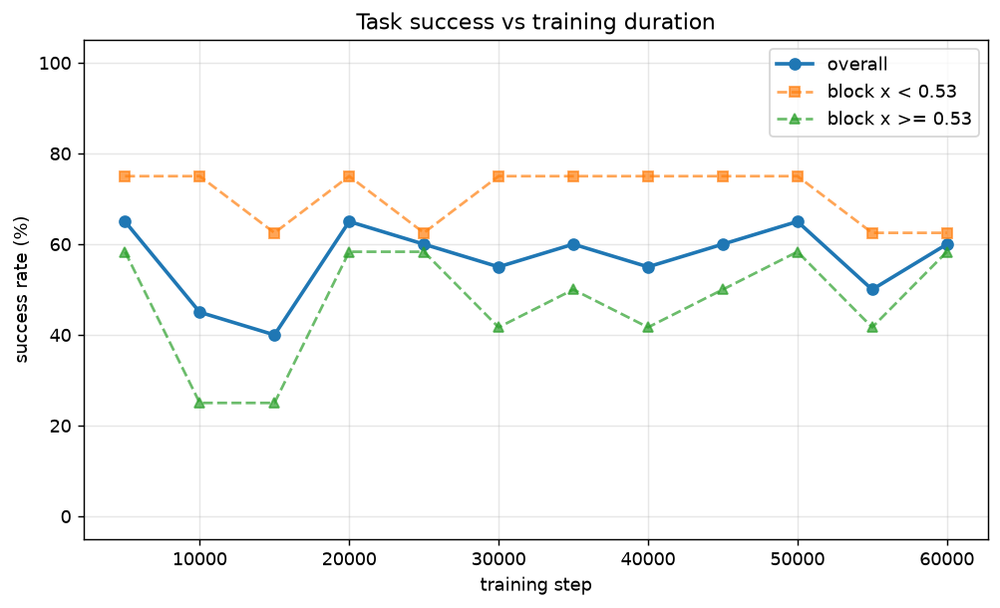
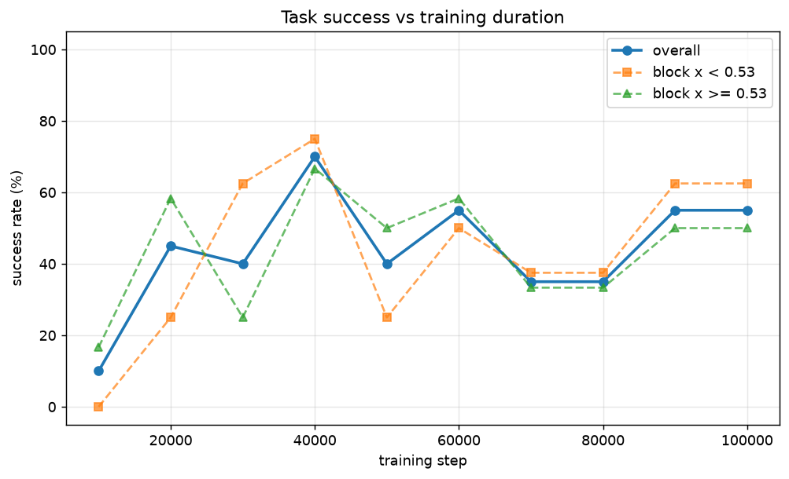
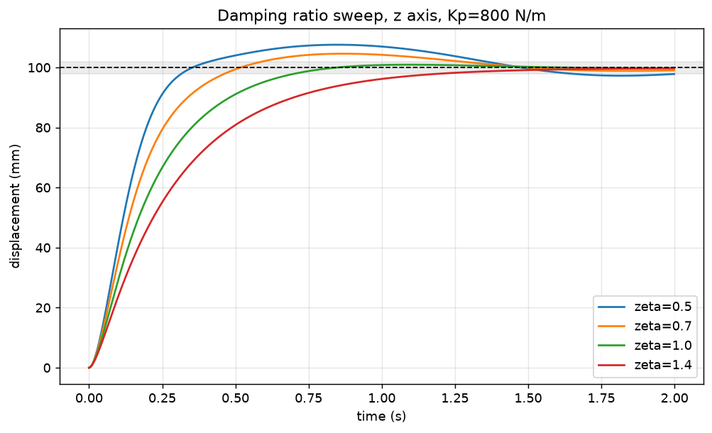
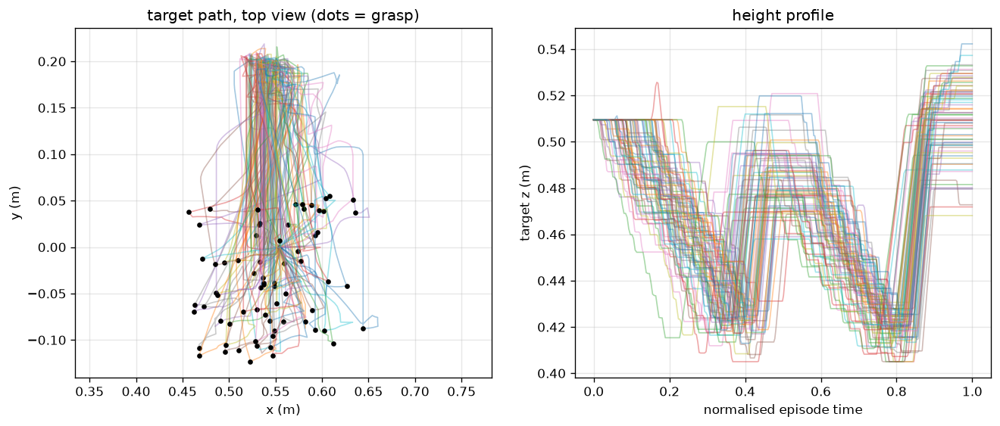
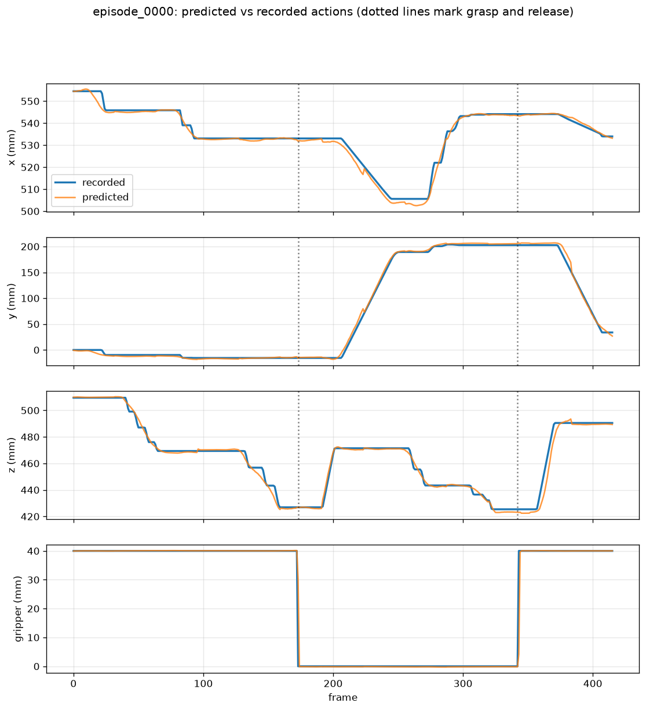

# FR3 Pick-and-Place: Simulation to Trained Policy

An end-to-end Physical AI pipeline built on Windows: a Cartesian impedance
controller for a 7-DOF Franka FR3 in MuJoCo, DualSense teleoperation for
demonstration collection, and imitation learning with ACT and Diffusion
Policy — plus an evaluation harness that reports task success rate rather
than loss.

Everything runs natively on Windows. No WSL, no dual boot, no cloud.

---

## Results

71 teleoperated demonstrations. Success rate over 20 randomised trials per
checkpoint, block spawned uniformly in an 18 × 18 cm region, success
defined as the block resting within 5 cm of the target.

| Policy | Best checkpoint | Success rate | Range across checkpoints |
|---|---|---|---|
| Diffusion Policy | 40,000 steps | **70%** | 10 – 70% |
| ACT | 5,000 steps | **65%** | 40 – 65% |

At 20 trials the standard error is roughly ±10%, so **70% and 65% are not
distinguishable**. The honest summary is that both architectures reach
55–70% on this dataset. What does separate them:

**ACT converges about 8× faster.** It reaches 65% at 5,000 steps — around
ten minutes of training — and stays flat at 55–65% through 60,000 steps.
Diffusion needs 40,000 steps to peak.

**ACT is ~14× cheaper at inference.** 3.2 s per evaluation trial versus
45 s: one transformer forward pass per action chunk, against 100 DDPM
denoising steps every 8 actions. At 30 Hz on real hardware that gap
matters.

**ACT imitates more precisely.** Under teacher forcing, mean position
error 4.2 mm versus 6.1 mm, grasp-phase error 1.5–3.0 mm versus 5.3–6.4
mm, and gripper timing within one frame with no spurious toggles.
Diffusion's predictions visibly oscillate, and it opens and closes the
gripper several times near release where the demonstration opens once.




### Two things the evaluation revealed

**Fit quality does not predict task success.** ACT's teacher-forced error
fell from 26 mm to 6.8 mm between step 5k and 55k while its success rate
did not move. Training loss is an even weaker signal. Only rollout
evaluation tells you where a policy actually peaks — which is why the
harness exists, and why it is validated against recorded demonstrations
before any policy is trusted.

**Success depends on where the object is.** Blocks near the base
(x < 0.53 m) succeed more often than blocks further out — 62–75% versus
25–58% for ACT. The arm's Jacobian condition number rises from 9.1 to 14.8
across that range, so the extended configuration is measurably harder to
control despite being nowhere near singular.

---

## Requirements

- Windows 10/11
- NVIDIA GPU. Built and tested on an RTX 5080 (Blackwell, sm_120)
- Python 3.11
- A DualSense controller, for collecting new demonstrations
- ~40 GB free disk for a 70-episode dataset at 640 × 480

---

## Setup

### 1. Python

Install Python 3.11 from python.org — not the Microsoft Store build, which
sandboxes paths and breaks venv activation. Check "Add python.exe to PATH".

### 2. Clone and create the environment

```powershell
git clone https://github.com/<your-username>/fr3-pick-place.git
cd fr3-pick-place
py -3.11 -m venv .venv
.\.venv\Scripts\Activate.ps1
```

If activation is blocked:

```powershell
Set-ExecutionPolicy -Scope CurrentUser -ExecutionPolicy RemoteSigned
```

### 3. PyTorch first, alone

Install PyTorch before anything else, so no other package pulls in a
wrong-CUDA build as a dependency.

```powershell
pip install --upgrade pip
pip install "torch==2.10.0" "torchvision==0.25.0" --index-url https://download.pytorch.org/whl/cu128
```

**Blackwell GPUs require the cu128 index.** Standard PyPI wheels contain
no sm_120 kernels. Verify both of these before continuing:

```powershell
python -c "import torch; print(torch.__version__, torch.cuda.is_available(), torch.cuda.get_device_capability())"
python -c "import torch; a=torch.randn(4096,4096,device='cuda'); print((a@a).sum().item())"
```

You need `(12, 0)` from the first and an actual number from the second.
`cuda.is_available()` returning True does not prove the kernels exist —
the matmul does.

### 4. Install the project

```powershell
pip install -e ".[train]"
```

Confirm the stack imports together:

```powershell
python -c "import torch, numpy, mujoco, lerobot; print(torch.__version__, numpy.__version__, mujoco.__version__, lerobot.__version__)"
```

### 5. Robot model

```powershell
git clone https://github.com/google-deepmind/mujoco_menagerie
```

Or set `MENAGERIE_DIR` if you keep it elsewhere.

### 6. Enable Developer Mode

Settings → System → For developers → Developer Mode **on**. LeRobot writes
a symlink when saving checkpoints, and Windows refuses symlinks without it.
Training will otherwise crash at the first checkpoint, hours in.

### 7. Route Python to the discrete GPU

Settings → System → Display → Graphics → Add desktop app → browse to
`.venv\Scripts\python.exe` → Options → **High performance**.

This is not optional and it is not obvious. Without it, MuJoCo's offscreen
renderer falls back to Microsoft's software rasterizer: **48 ms per frame
instead of 0.8 ms**, a 60× penalty. The interactive viewer works fine
either way, because windowed OpenGL follows a different routing path — so
"the viewer is smooth" is not evidence that headless rendering is on the
GPU. Measure it, don't assume it.

### 8. Build the scene

```powershell
fr3-build-scene
python -m src.scripts.preview_cameras
```

This generates `models/fr3_pick_place.xml` from Menagerie's bare FR3 by
adding a parallel-jaw gripper, a table, a graspable block, and three
cameras. The verify output should report `nq=16 nv=15 nu=7`.

---

## Pipeline

### Phase 1 — Impedance controller

A Cartesian impedance controller with dynamically-consistent nullspace
posture regulation:

```
tau = J^T (Kp * pose_error - Kd * ee_velocity)     task space
    + N (Kp_n * posture_error - Kd_n * qvel)       nullspace
    + qfrc_bias                                    gravity + Coriolis
    - qfrc_passive                                 model damping
```

Damping is recomputed each step from the task-space inertia
(`Kd = 2ζ√(Λ·Kp)`), so the damping ratio stays at ζ regardless of arm
configuration. Apparent inertia at the tip varies by more than 10× across
the workspace, which is why fixed damping gains feel right in one pose and
mushy in another.

**Interactive feel test:**

```powershell
python -m src.scripts.impedance_hold
```

`WASD`/`QE` move the target, `[`/`]` change stiffness, `n` toggles the
nullspace term. Push the elbow while watching the tip: with nullspace on,
the elbow reconfigures and the tip stays put.

**Quantitative characterisation:**

```powershell
python -m src.scripts.tune_step
```

Runs step response per axis, a frequency sweep, a stiffness sweep, a
damping-ratio sweep, and a joint-friction comparison. Writes plots to
`logs/`.

Measured gain sets:

| Use | Kp (N/m) | ζ | Bandwidth | Overshoot |
|---|---|---|---|---|
| Transit | 800 | 0.7 | 1.5 Hz | 2.9% |
| Contact | 300 | 1.0 | 0.4 Hz | 0% |



### Phase 2 — Teleoperation and data collection

```powershell
python -m src.scripts.test_pad      # verify controller mapping first
fr3-collect
```

**Controls:** left stick moves in x/y, L2/R2 move down/up, right stick
pitches and yaws, L1/R1 roll, Square/Cross close and open the gripper.
D-pad Up starts recording, Right saves, Down discards.

Stick deflections are integrated into an **absolute target pose**, and
that pose is what gets logged as the action. This matters: the impedance
controller consumes target poses, so the same controller serves both data
collection and policy inference without modification. Logging velocities
would require a different interface at inference time.

The gripper is **binary**. A rigid cube has no use for intermediate
openings, a continuous target gets averaged across demonstrations into a
gradual closure that clips the block, and binary matches what VLA action
heads are pretrained on.

**Validate before collecting hundreds:**

```powershell
fr3-validate
python -m src.scripts.inspect_episode --batch 4
```



### Phase 3 — Training

Re-render at training resolution first. This is not optional for
throughput:

```powershell
fr3-rerender
fr3-to-lerobot
```

`rerender.py` replays each episode's recorded actions through the
simulator and re-renders every camera at 128 × 160. Because the state
arrays hold all joint angles, the scene at any frame is exactly
reconstructible — no data is re-collected. Joint drift after replay stays
under 0.005 rad across a 400-step episode.

The reason this matters: at 640 × 480 the dataloader spent **0.97 s per
step** decoding and resizing PNGs while the GPU update took 0.13 s. The
GPU idled 88% of the time. After re-rendering, `data_s` drops to 0.07 and
training runs 7× faster.

**Train ACT:**

```powershell
$env:PYTHONIOENCODING="utf-8"

lerobot-train `
  --dataset.repo_id=local/fr3_pick_place_small `
  --dataset.root=.\data\lerobot\local_fr3_pick_place_small `
  --dataset.image_transforms.enable=true `
  --policy.type=act `
  --policy.device=cuda `
  --policy.use_amp=true `
  --policy.chunk_size=32 `
  --policy.n_action_steps=32 `
  --policy.n_obs_steps=1 `
  --policy.kl_weight=1.0 `
  --policy.optimizer_lr=1e-4 `
  --policy.optimizer_lr_backbone=1e-5 `
  --policy.push_to_hub=false `
  --batch_size=64 `
  --steps=20000 `
  --save_freq=5000 `
  --output_dir=.\outputs\act_v2 `
  --job_name=act_v2
```

`PYTHONIOENCODING=utf-8` is needed because LeRobot's help text and policy
names contain non-cp1252 characters that crash the Windows console.

**ACT's default learning rate of 1e-5 is too low at this data scale.**
It was tuned for ALOHA's bimanual tasks with hundreds of episodes and
100k+ steps. On 71 episodes, 1e-5 reached 43 mm fit error at 20k steps;
1e-4 reached 26 mm at 5k. Keep the backbone at 1e-5 to preserve the
pretrained ImageNet features.

**Train Diffusion Policy:**

```powershell
lerobot-train `
  --dataset.repo_id=local/fr3_pick_place_small `
  --dataset.root=.\data\lerobot\local_fr3_pick_place_small `
  --dataset.image_transforms.enable=true `
  --policy.type=diffusion `
  --policy.device=cuda `
  --policy.use_amp=true `
  --policy.crop_shape="[115,144]" `
  --policy.horizon=16 `
  --policy.n_action_steps=8 `
  --policy.n_obs_steps=2 `
  --policy.down_dims="[256,512,1024]" `
  --policy.optimizer_lr=1e-4 `
  --policy.push_to_hub=false `
  --batch_size=64 `
  --steps=50000 `
  --save_freq=10000 `
  --output_dir=.\outputs\diffusion_v2 `
  --job_name=diffusion_v2
```

---

## Evaluation

The harness runs the trained policy in the same simulator, with the same
impedance gains, the same block distribution, and the same success
criterion used to label the demonstrations. That shared definition is what
makes the number comparable to anything.

**Validate the harness itself first:**

```powershell
python -m src.scripts.test_harness
```

Replays recorded actions from ten episodes. All ten should succeed. If
they do not, the harness has diverged from the collection environment and
every success rate it reports would be wrong in the same invisible way.

**Check the plumbing before spending time on trials:**

```powershell
fr3-eval --run act_v2 --checkpoint 005000 --type act --check
```

Compares the policy's prediction against a recorded action on a training
frame. Expect a few millimetres. Predictions confined to [-1, 1] mean the
postprocessor is not being applied and the action is still normalised.

**Run trials:**

```powershell
fr3-eval --run act_v2 --checkpoint 005000 --type act --trials 20 --video
```

**Sweep every checkpoint:**

```powershell
fr3-sweep --run act_v2 --type act --trials 20
```

**Diagnose a failing policy:**

```powershell
python -m src.scripts.replay_predict --run act_v2 --checkpoint 005000 --type act
```

Feeds a recorded episode's observations through the policy and plots the
predicted action trajectory against the recorded one, with per-phase error
and gripper timing. Teacher-forced, so it measures fit rather than
closed-loop behaviour — but it separates "the policy did not learn the
task" from "the policy learned it and drifts in rollout", which a success
rate alone cannot.



---

## Repository layout

```
src/
  config.py                    Paths and shared constants
  controllers/impedance.py     Cartesian impedance controller
  teleop/dualsense.py          Pad reader and target-pose integrator
  data/recorder.py             Episode buffering and disk format
  data/task.py                 Block randomisation and success criterion
  eval/rollout.py              Rollout harness
  eval/policy_wrapper.py       LeRobot policy + processor adapter
  scripts/                     Entry points, one concern each
tests/                         Invariants whose violation is silent
docs/                          Result plots referenced by this README
```

---

## Data format

Episodes are written as raw directories first, then converted to
LeRobotDataset offline. Conversion is deliberately separate: LeRobot's
dataset API changes between versions, and a collection session should
never be lost to a library upgrade.

```
observation.state    (16,)  7 joint pos, 7 joint vel, 2 finger pos
observation.images   three RGB streams
action               (8,)   target position 3, target quaternion 4, gripper 1
```

Design choices made for cross-architecture reuse:

- **Absolute target poses**, not velocities, so one controller serves
  collection and inference
- **Binary gripper**, matching what VLA action heads expect
- **Task string per episode**, required for language-conditioned policies
- **Workspace bounds in metadata**, so normalisation is reproducible
- **Block pose excluded from observations** — available in simulation but
  not on hardware, and a policy that reads it learns to skip perception

---

## Gotchas

Each of these cost real debugging time. All produced plausible-looking
wrong results rather than errors.

**Evaluation resolution must match training resolution.** The vision
backbone is fully convolutional and accepts any input size silently, but
`crop_shape` is applied in pixels. Rendering at 640 × 480 for a policy
trained at 128 × 160 turns a whole-scene 90% crop into a 115 × 144 patch
of dead centre — the policy goes effectively blind and runs on
proprioception alone. This dropped measured success from 60% to 0.4%. The
tell was identical rollout distances across different checkpoints and
different architectures.

**MuJoCo's API moved.** `data.qM` was renamed to `data.M`, still holds the
sparse packed lower triangle rather than the dense matrix, and
`mj_fullM`'s signature changed from `(model, dst, src)` to
`(model, data, dst)`. `mass_matrix()` in `impedance.py` handles all three
variants.

**`qfrc_bias` does not include passive joint forces.** It holds only
`C(q,q̇)q̇ + g(q)`. MuJoCo's joint damping and springs live in
`qfrc_passive` and are added independently, so leaving them uncompensated
means the model's damping stacks on the controller's and the achieved
damping ratio is not the requested ζ.

**Dry friction cannot be cancelled feedforward.** Menagerie's FR3 sets
~6 Nm of total `frictionloss`, producing a constant ~6 N opposing force
and 22 mm of steady-state error at Kp=300. It is resolved by the
constraint solver, not readable as a force, so it is zeroed for controller
characterisation. On hardware it is real and sets a minimum usable
stiffness: `Kp × acceptable_error > 6 N`.

**DualSense button indices differ from the documented SDL mapping.** On
this pad L1/R1 are 9 and 10, not 4 and 5 — indices 4 and 5 are Share and
the PS button. Verify empirically with `test_pad.py`.

**Windows console encoding.** LeRobot prints policy names containing `π`,
which crashes cp1252. Set `PYTHONIOENCODING=utf-8`.

---

## Roadmap

- [x] Cartesian impedance controller, characterised
- [x] DualSense teleoperation and demonstration collection
- [x] Evaluation harness, validated against recorded demonstrations
- [x] ACT training and evaluation — 65% at 5k steps
- [x] Diffusion Policy training and evaluation — 70% at 40k steps
- [ ] 100-trial evaluation on both best checkpoints, to separate 65% from
      70% with defensible error bars
- [ ] Larger dataset — 71 episodes is thin for a randomised object
- [ ] Multimodal task variant, comparing ACT and diffusion on
      demonstration multimodality
- [ ] π0 fine-tuning
- [ ] RL with Isaac Lab parallel environments
- [ ] Sim-to-real transfer

---

## Acknowledgements

Robot model from [MuJoCo Menagerie](https://github.com/google-deepmind/mujoco_menagerie).
Training and dataset infrastructure from [LeRobot](https://github.com/huggingface/lerobot).

## License

MIT