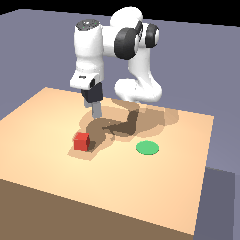
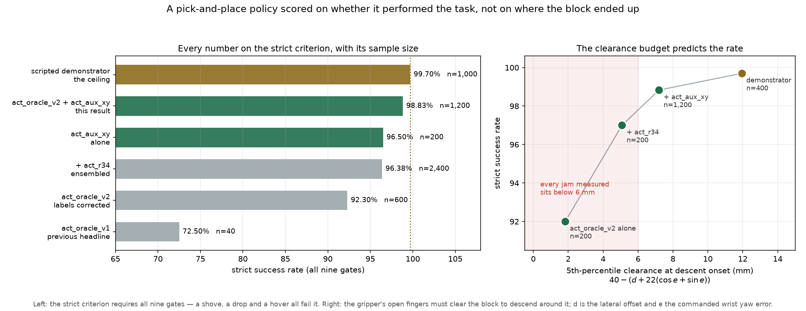
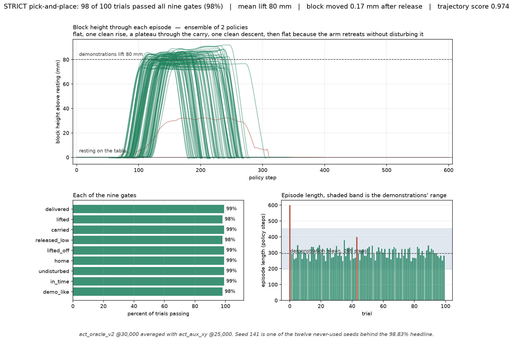
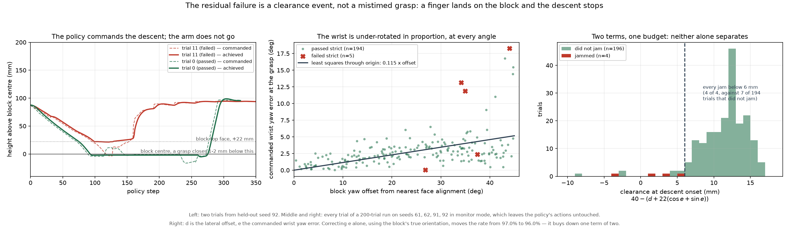

# FR3 Pick-and-Place: Simulation to Trained Policy

A full robot-learning pipeline on Windows: a Cartesian impedance controller
for a 7-DOF Franka FR3 in MuJoCo, DualSense teleoperation to collect
demonstrations, imitation learning with ACT and Diffusion Policy, and an
evaluation harness that scores whether the robot *performed the task*
rather than whether the block ended up in the right place.

**98.83% strict success over 1,200 trials on seeds never used for any
decision.** The scripted demonstrator that generated the training data
scores 99.70%, so the learned policy is 0.87 points behind its teacher.



*One episode of the deliverable policy, recorded at 960×960 from a camera
the policy cannot see. It sees only three 160×128 views and its own joint
encoders — the block's pose is never an input.
Full-resolution mp4: [docs/demo_pick_place.mp4](docs/demo_pick_place.mp4).*

---

## Contents

- [Results](#results) — the numbers, and what the remaining failures are
- [What you need to know to read the numbers](#what-you-need-to-know-to-read-the-numbers) — the criterion, and two measurement rules
- [Reproduce it](#reproduce-it) — setup and the commands
- [Repository layout](#repository-layout)
- [Documentation](#documentation) — everything else

---

## Results



Trained on 997 oracle-generated episodes. Every row is reported on seeds
that played no part in choosing its checkpoint or suggesting its
experiment.

| policy | loose | **strict** | n |
|---|---|---|---|
| previous headline (`act_oracle_v1`) | 92.5% | 72.5% | 40 |
| `act_oracle_v2`, ResNet18, chunk 32 | 96.7% | 92.3% ± 2.6% | 600 |
| `act_r34`, ResNet34, chunk 32 | 95.0% | 93.0% ± 1.3% | 600 |
| `act_oracle_v2` + `act_r34` | 97.8% | 96.38% | 2,400 |
| `act_aux_xy` alone | 97.5% | 96.50% | 200 |
| **`act_oracle_v2` + `act_aux_xy`** | **99.0%** | **98.83%** | **1,200** |
| scripted demonstrator, jitter 1.0 | 99.9% | 99.70% | 1,000 |

**98.83% strict, 95% confidence interval 98.23 to 99.44**, pooled over
twelve seeds of 100 trials. Per seed
100/98/98/98/98/98 · 98/100/100/100/99/99. Against the previous best of
96.38% over 2,400 trials that is **+2.46 points, se 0.49, z = 5.00**.

All nine gates pass at 98.83% or better. Mean lift **81 mm** against the
demonstrations' 80; the block moves 0.17 mm after release.

### What 98 of 100 trials look like



The top panel is the plot that caught four separate reward exploits earlier
in this project. A correct episode reads flat on the table, one clean rise
to about 80 mm, a plateau through the carry, one clean descent, and **flat
afterwards**, because the arm retreats without disturbing what it put down.
A shove never leaves the table. A drop falls. A hover never comes back down.

### What the remaining failures are

Fourteen failures in 1,200. They are not mistimed grasps, which is what
this project believed for two sessions. The policy commands the descent
**correctly** — target 3.5 mm below the block's centre, held for 15
consecutive steps — while the tool sits at +21.9 mm moving 0.01 to 0.08 mm
per step against 1.2 to 1.5 in a free descent, fingers wide open, commanded
orientation tracked to 0.4°.

The arm is **in contact**: a finger is resting on the block's top face
because the gripper arrived with too little room to descend around it.

```
clearance = 40 mm − ( lateral offset + 22·(cos e + sin e) )
```

A finger face sits 40 mm from the tool centre when open, and a 44 mm cube at
wrist yaw error `e` presents `22(cos e + sin e)` of half-extent. **Every jam
measured sits under 6 mm of clearance**, against a median of 12.



It is governed by **two terms that trade off**, which is why four separate
single-variable explanations — timing, lateral offset, the cube's symmetry
boundary, the wrist yaw — each looked right on a handful of trials and each
failed at scale. One jam happens with the wrist 0.8° from perfect alignment
and 13.78 mm of lateral offset; another with 5.26 mm of offset and 29.69 mm
of extent.

The clearance budget also accounts for the whole remaining gap to the
demonstrator, and it is a distribution's **tail** rather than its centre:

| at descent onset | **demonstrator**, n=400 | **`act_oracle_v2`**, n=200 |
|---|---|---|
| clearance, **minimum** | **+6.40 mm** | **−12.87 mm** |
| clearance, p5 | 11.94 mm | 1.83 mm |
| trials under 6 mm | **0 (0.00%)** | 35 (17.50%) |
| commanded yaw error, median / max | **0.00 / 0.00°** | 2.31 / **38.19°** |

The demonstrator's worst trial in 400 has more clearance than the student's
fifth percentile, and never enters the band where every jam happens.

### What produced the gain, and what is now ruled out

The second ensemble member, `act_aux_xy`, adds the block's x and y to the
action vector as extra regression targets, so the representation is
*required* to carry the block's position rather than merely permitted to.
The idea had been built and validated a session earlier and never run.

It did what the budget predicted: maximum lateral offset fell from 29.75 mm
to 14.38, and the clearance minimum went from **−12.87 mm to +1.41**. On its
own it is **not** significantly better than the baseline (96.50% against
94.00% on identical trials, exact McNemar **p = 0.36**). What earns the 2.46
points is that its failures are **disjoint** from the baseline's — of 200
paired trials, 12 fail only under the baseline, 7 only under the aux policy,
and **none fail under both**. Averaging two policies that fail in different
places is the one case where an ensemble beats either, which is also why
adding a third member (`act_chunk64`) *lost* five points.

Measured and negative, so you do not have to repeat them:

| intervention | result |
|---|---|
| runtime supervisor: veto a mistimed close, detect a failed grasp, replan | **six configurations, all 97.00%, all failing the same six trials** |
| third ensemble member | 97.0% → **92.0%** |
| correcting wrist yaw with the simulator's **true** block orientation | 97.0% → **96.0%** |
| camera-only yaw estimation, 6,500 non-leaky samples | **at chance** (22.3° at 160×128, 21.4° at 320×256; chance 22.5°) |
| replanning more often (`n_action_steps` 32 → 16 → 8) | 92.5% → 85.0% → **32.5%** |
| DAgger, 285 on-policy episodes mixed into the 997 | 92.5% → **65.0%** |

The yaw term is **not recoverable from these three camera views at any
resolution tested**, which makes camera placement — or a wrist view closer
to the fingers — the highest-value change available, not more training.

### Trained weights

The checkpoints are published on the
[releases page](https://github.com/Himanshu12328/fr3-pick-place/releases),
since datasets and training outputs are not tracked here. Each archive
holds the `pretrained_model` directory only, which is what inference needs;
optimiser state for resuming training is not included.

---

## What you need to know to read the numbers

### The success criterion changed partway through this project

Every success rate in [docs/RESULTS_HISTORY.md](docs/RESULTS_HISTORY.md)
was measured with `check_success`: the block ends resting within 5 cm of the
target. That does not ask whether the robot picked the block up, whether it
let go, whether it let go gently, or whether it did any of it at a speed a
person would recognise.

Stage 2 found five separate reward exploits, four of them in policies
reporting 99% or better, and every one satisfied `check_success` while doing
something the criterion could not see: shoving the block across the table,
dropping it from 95 mm, or ending with it gripped in mid-air.

`src/eval/strict.py` replaces it with **nine gates** covering the whole
specified sequence — approach, grasp, lift, carry, descend, gentle release,
lift off, return home — scored against bands measured from all 221 recorded
demonstrations. See [docs/STRICT_EVAL.md](docs/STRICT_EVAL.md).

The gap is not cosmetic:

| policy | loose `check_success` | **strict** |
|---|---|---|
| scripted oracle | 100.0% | **100.0%** |
| oracle driven at 3× demonstration speed | 100.0% | **0.0%** |
| ACT, the old 86.8% policy | 92.5% | **72.5%** |

The middle row is the point. Identical waypoints, identical controller, only
the speed changed: it passes the old criterion on every trial and fails the
new one on every trial.

### Two measurement rules, both learned by getting them wrong

**A number that decides what gets built next does not get measured on 40
trials.** The demonstrator was reported at 97.5% strict for a full session,
which was `39/40`. Remeasured over 1,000 trials it is **99.70%**. The
conclusion resting on it — "the student has caught its teacher, so further
gains need better data" — was false, and the two data interventions it
recommended were aimed at a problem that did not exist.

**1,200 trials cannot quote this rate to a tenth of a point.** Two clean
1,200-trial measurements of one unchanged policy landed **1.25 points
apart** (97.00% and 95.75%). Sweep peaks over-report by 5 to 7 points,
measured five times: a checkpoint that screened at 100% on 80 trials scored
96.50% on fresh ones. So sweep to *find* a checkpoint, use fresh seeds to
*report* it, and prefer a continuous quantity when you need to see a small
change. The fifth-percentile clearance above is that quantity — it orders
every policy measured in the same order as their success rates, and
`src/scripts/clearance_report.py` computes it from any run.

---

## Reproduce it

Short path below. Every step, including the Windows-specific ones that are
easy to miss and expensive to diagnose, is in
**[docs/SETUP.md](docs/SETUP.md)**.

```powershell
# 1. Environment. PyTorch first, on its own, from the CUDA index.
py -3.11 -m venv .venv
.\.venv\Scripts\Activate.ps1
pip install torch torchvision --index-url https://download.pytorch.org/whl/cu128
pip install -e ".[train,dev]"

# 2. The robot model, then the scene.
git clone https://github.com/google-deepmind/mujoco_menagerie
python -m src.scripts.build_scene
```

Three Windows settings matter, and each silently costs performance or
crashes training if missed: set `python.exe` to *High performance* in
Graphics Settings, disable Energy Saver, and enable Developer Mode.
[docs/SETUP.md](docs/SETUP.md) explains why.

```powershell
# 3. Validate the harness before trusting any number it prints.
python src\scripts\test_harness.py          # expect 10/10 replays

# 4. Evaluate the deliverable policy.
python -m src.scripts.eval_supervised --mode monitor `
  --members outputs/act_oracle_v2/checkpoints/030000/pretrained_model `
            outputs/act_aux_xy/checkpoints/025000/pretrained_model `
  --seeds 131 132 133 134 135 136 --trials 100 --workers 6

# 5. The clearance budget behind that number.
python -m src.scripts.clearance_report logs/strict_supervised.json

# 6. Regenerate the figures and the demo video.
python -m src.scripts.figure_results
python -m src.scripts.record_demo --trials 4 --seed 131 --gif
```

Evaluation parallelises by seed, never within one: the harness draws block
placements from a single generator advanced trial by trial, so splitting one
seed across processes would change the placements and silently produce a
different experiment. Split by seed and every trial stays bit-identical —
200 trials in 3.6 minutes against about 15 serial.

To collect data and train from scratch, see
**[docs/PIPELINE.md](docs/PIPELINE.md)**.

---

## Repository layout

```
src/
  config.py                    Paths and shared constants, single source of truth
  controllers/impedance.py     Cartesian impedance controller
  teleop/dualsense.py          Pad reader and target-pose integrator
  data/task.py                 Block randomisation and the loose criterion
  eval/strict.py               The nine gates
  eval/ensemble.py             Averaging two policies, voting the gripper
  eval/supervisor.py           Runtime layer, and the negative result about it
  eval/oracle.py               Scripted demonstrator
  scripts/                     Entry points, one concern each
tests/test_invariants.py       Invariants whose violation is silent
docs/                          Everything else, indexed below
```

---

## Documentation

| | |
|---|---|
| [docs/PATH_TO_99.md](docs/PATH_TO_99.md) | How the residual 3% was diagnosed and 98.83% reached. Predictions written before each run; four sections propose a cause a later one refutes |
| [docs/PATH_TO_97.md](docs/PATH_TO_97.md) | The strict criterion, the label defect worth 20 points, and ten defects found along the way — five in the evaluation harness itself |
| [docs/STRICT_EVAL.md](docs/STRICT_EVAL.md) | The nine gates, and how each band was measured |
| [docs/SETUP.md](docs/SETUP.md) | Requirements and setup in full |
| [docs/PIPELINE.md](docs/PIPELINE.md) | Controller, collection, training, evaluation, data format |
| [docs/STAGES.md](docs/STAGES.md) | Every stage: what was planned, what was measured, where they differed |
| [docs/RESULTS_HISTORY.md](docs/RESULTS_HISTORY.md) | Earlier results on the loose criterion, and the data-scaling curves |
| [docs/RL_PROCESS.md](docs/RL_PROCESS.md) | Eleven RL runs, and the five reward exploits they produced |
| [docs/GOTCHAS.md](docs/GOTCHAS.md) | Failures that produced wrong results instead of errors |
| [docs/ROADMAP.md](docs/ROADMAP.md) | What is done and what is not |
| [docs/RUNBOOK.md](docs/RUNBOOK.md) | Command reference |

---

## Acknowledgements

The FR3 model comes from [MuJoCo Menagerie](https://github.com/google-deepmind/mujoco_menagerie).
Policy implementations and the training loop are [LeRobot](https://github.com/huggingface/lerobot).

## License

MIT.
